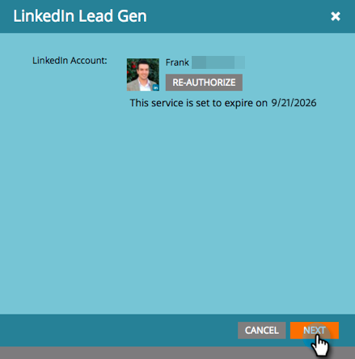
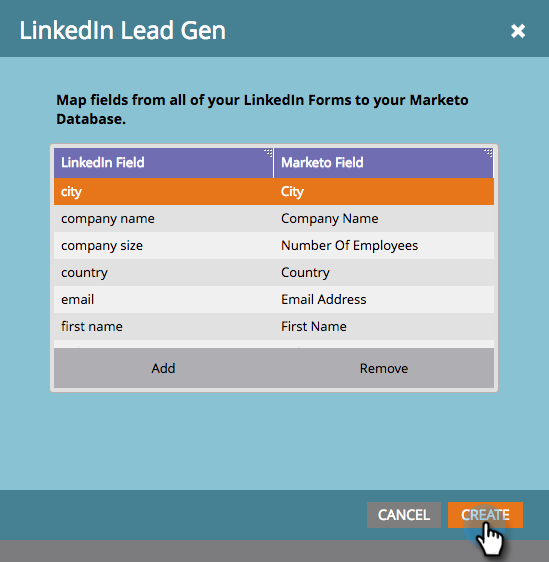

# Configurare moduli di generazione di lead LinkedIn {#set-up-linkedin-lead-gen-forms}

Utilizza LinkedIn Lead Gen Forms per eseguire campagne pubblicitarie in LinkedIn e generare lead per Marketo.

>[!NOTE]
>
>* **Autorizzazioni amministratore richieste**
>
>* Quando si creano moduli LinkedIn Lead Gen, assicurarsi che il nome del modulo non contenga solo caratteri numerici. Il nome del modulo deve essere alfabetico o alfanumerico.
>
>* Un lead LinkedIn non entra in Marketo Engage se corrisponde a un record persona esistente in Marketo associato a un record società creato utilizzando le API società e la sottoscrizione Marketo non è connessa a un CRM.

1. Passa alla schermata **[!UICONTROL Admin]**.

   

1. Vai a **[!UICONTROL LaunchPoint]**, fai clic su **[!UICONTROL New]** e seleziona **[!UICONTROL New Service]**.

   

1. Immetti un _Nome visualizzato_ per il servizio, seleziona il servizio **[!UICONTROL LinkedIn Lead Gen]** dall&#39;elenco a discesa e fai clic su **[!UICONTROL Next]**.

   

1. Marketo apre una nuova scheda nello stesso browser a [linkedin.com](https://www.linkedin.com){target="_blank"}. Accedi a LinkedIn utilizzando l’account che desideri utilizzare per l’integrazione.

   >[!NOTE]
   >
   >L’account LinkedIn deve accedere a tutti gli account LinkedIn Business per i quali stai creando campagne sponsorizzate.

   

1. Dopo aver effettuato l&#39;accesso a LinkedIn, tornare a Marketo e fare clic su **[!UICONTROL Authorize]**.

   

1. Quando richiesto, fare clic su **[!UICONTROL Allow]** per accettare l&#39;installazione dell&#39;app Marketo in LinkedIn.

   

1. Noterai che ora sei autorizzato. Fai clic su **[!UICONTROL Next]**.

   

   >[!CAUTION]
   >
   >Il servizio scade automaticamente un anno dopo l’autorizzazione. Per recuperare l&#39;accesso, fare clic su **[!UICONTROL Re-Authorize]**. Potrebbe essere necessario reimmettere la password di LinkedIn, a seconda delle impostazioni del browser.

1. Selezionare gli account da cui si desidera che i lead Gen di LinkedIn vengano inseriti in Marketo e fare clic su **[!UICONTROL Next]**.

   >[!TIP]
   >
   >Se gli account business previsti non sono visualizzati, verificare che l&#39;account LinkedIn dell&#39;utente che si sta autorizzando disponga delle autorizzazioni Lead Gen Form Manager per l&#39;account business in LinkedIn.

   

1. Per accettare le mappature predefinite dei campi LinkedIn a Marketo, fare clic su **[!UICONTROL Create]**. Se desideri modificare la mappatura di campo predefinita, rimuovere una mappatura di campo o aggiungere una nuova mappatura di campo, puoi farlo in base al campo, tramite la finestra modale seguente.

   >[!CAUTION]
   >
   >Marketo supporta il mapping di due campi LinkedIn a un singolo campo Marketo, _ma solo quando_ i due campi LinkedIn non si trovano nello stesso modulo. Se si esegue il mapping di due campi dello stesso modulo LinkedIn a un singolo campo Marketo, è possibile che gli utenti non siano in grado di immettere il database Marketo.

   

   >[!NOTE]
   >
   >Solo i campi LinkedIn che sono già stati salvati in un [modello di modulo](https://www.linkedin.com/help/lms/answer/79634){target="_blank"} in LinkedIn Campaign Manager verranno visualizzati come campi LinkedIn che è possibile mappare ai campi Marketo.

   

Ben fatto! Le persone che inviano i moduli LinkedIn Lead Gen inizieranno a fluire in Marketo quando si eseguono campagne di successo sul lato LinkedIn.

>[!NOTE]
>
>Puoi autorizzare un solo account utente di LinkedIn. Se disponi di più account aziendali da collegare a Marketo, accertati che l’account LinkedIn dell’utente che viene autorizzato disponga delle autorizzazioni Lead Gen Form Manager per l’account aziendale in LinkedIn.

>[!MORELIKETHIS]
>
>[Utilizzare i filtri e i trigger di modulo LinkedIn Lead Gen in una campagna avanzata](/help/marketo/product-docs/demand-generation/social/social-functions/use-linkedin-lead-gen-form-filters-and-triggers-in-a-smart-campaign.md){target="_blank"}
