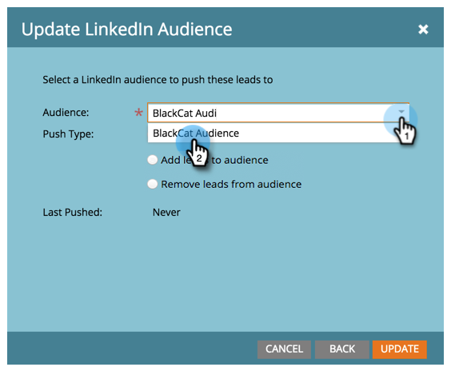

# Utilizzare un elenco Marketo o un elenco avanzato come segmento di pubblico LinkedIn {#use-a-marketo-list-or-smart-list-as-a-linkedin-audience-segment}

Integra le persone di Marketo Engage con il pubblico di LinkedIn.

>[!PREREQUISITES]
>
>[Aggiungi tipi di pubblico LinkedIn corrispondenti come servizio LaunchPoint](/help/marketo/product-docs/demand-generation/ad-network-integrations/add-linkedin-matched-audiences-as-a-launchpoint-service.md){target="_blank"}

1. Passare a **[!UICONTROL Database]**.

   

1. Selezionare un elenco avanzato.

   

1. Fare clic sulla scheda **[!UICONTROL People]**.

   

1. Fai clic sull&#39;icona _Invia tramite Ad Bridge_  nella parte inferiore dell&#39;elenco.

   

   >[!NOTE]
   >
   >Quando si utilizzano integrazioni di rete di annunci per inviare un pubblico a LinkedIn, Marketo invia solo l’indirizzo e-mail tramite.

1. Seleziona **[!UICONTROL LinkedIn]** e fai clic su **[!UICONTROL Next]**.

   

1. Seleziona un pubblico _LinkedIn_.

   >[!NOTE]
   >
   >Facendo clic su **[!UICONTROL +New Audience]** verrà creato un pubblico in LinkedIn Campaign Manager.

   

   >[!NOTE]
   >
   >LinkedIn ha dichiarato obsolete le API utilizzate per il tipo push &quot;Clear audience and add lead&quot; (Cancella pubblico e aggiungi lead) a marzo 2018. Questa opzione non è più disponibile dalla versione di Marketo del primo trimestre 2018.

1. Seleziona _[!UICONTROL Push Type]_. Fai clic su **[!UICONTROL Update]**.

   

   >[!NOTE]
   >
   >Attendere 15 minuti per eseguire la sincronizzazione.

Cinque in alto! Adesso i tuoi dati saranno disturbati dai tipi di pubblico di LinkedIn. Per informazioni sul caricamento di elenchi su LinkedIn per il targeting di account e contatti, visita il [Centro assistenza per le soluzioni di marketing di LinkedIn](https://www.linkedin.com/help/lms/answer/73938?query=ad%20segment){target="_blank"}.
