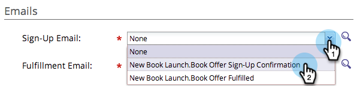

# Utilizzare le e-mail nelle promozioni social {#use-emails-in-social-promotions}

Quando crei una [offerta di riferimento](/help/marketo/product-docs/demand-generation/social/referral-offers/create-a-referral-offer.md) o [panorami](/help/marketo/product-docs/demand-generation/social/sweepstakes/create-sweepstakes.md), puoi includere e-mail da inviare quando la persona si iscrive e di nuovo quando la persona ha vinto la ricompensa.

>[!TIP]
>
>Per creare un messaggio e-mail, consulta [Invia un&#39;e-mail di avviso](/help/marketo/getting-started/quick-wins/send-an-email.md).

Nelle e-mail, utilizza i seguenti token:

* **Indirizzo e-mail di registrazione**: Utilizzo **`{{social.Share Url}}`** per inviare a ciascuna persona partecipante un collegamento di condivisione personalizzato.

* **E-mail di evasione**: Utilizzo **`{{social.Promo Code}}`** per inviare a ogni vincitore un [codice promozionale](/help/marketo/product-docs/demand-generation/social/social-functions/use-promo-codes-for-offer-fulfillment.md).

>[!PREREQUISITES]
>
>Prima di poter aggiungere un&#39;e-mail a un&#39;app social, deve essere _operativo_ e _approvato_. Vedi [Modificare le impostazioni per un messaggio e-mail](/help/marketo/product-docs/email-marketing/general/functions-in-the-editor/make-an-email-operational.md).

1. Vai a **Attività di marketing**.

   

1. Seleziona l’app e fai clic su **Modifica bozza**.

   

1. Nell’editor di app social, vai a **Impostazioni app > Dettagli offerta** o **Dettagli**).

   

1. Aggiungi il messaggio e-mail di registrazione.

   

   >[!NOTE]
   >
   >L’e-mail di conferma viene inviata automaticamente quando una persona si iscrive.

1. Aggiungi l’e-mail di evasione.

   

1. In un’offerta di riferimento, scegli se l’e-mail di evasione viene inviata automaticamente o manualmente.

   

>[!NOTE]
>
>In una sweep, l’e-mail di evasione viene sempre inviata automaticamente quando [seleziona il vincitore](/help/marketo/product-docs/demand-generation/social/sweepstakes/select-sweepstakes-winners.md).

>[!NOTE]
>
>**Definizione**
>
>* **auto su obiettivo**: L’e-mail di evasione viene inviata automaticamente quando ogni partecipante soddisfa l’obiettivo.
>* **inviare manualmente**: Quando le persone iniziano a raggiungere l’obiettivo, torna all’offerta di riferimento per [invia l’e-mail di evasione](/help/marketo/product-docs/demand-generation/social/referral-offers/send-referral-offer-fulfillment-email.md).
>

>[!MORELIKETHIS]
>
>Successivamente, puoi [scegli l&#39;URL di condivisione](/help/marketo/product-docs/demand-generation/social/social-functions/choose-the-share-url-for-a-social-app.md) oppure, nell’offerta di riferimento, puoi [carica i codici promozionali](/help/marketo/product-docs/demand-generation/social/social-functions/use-promo-codes-for-offer-fulfillment.md) la manderete.
