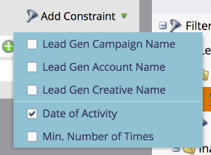

# Utilizzare i filtri e i trigger del modulo di generazione di lead LinkedIn in una campagna avanzata {#use-linkedin-lead-gen-form-filters-and-triggers-in-a-smart-campaign}

Dopo aver abilitato LinkedIn Lead Gen Forms, puoi utilizzarli come filtri e attivatori nelle campagne intelligenti.

>[!NOTE]
>
>Quando le persone inviano le proprie informazioni in un modulo LinkedIn Lead Gen, queste vengono inviate immediatamente a Marketo, rendendo il modulo disponibile nel menu a discesa Lead Gen Form Name. I nomi dei moduli non saranno visibili fino a quando almeno una persona non avrà inviato il modulo.

1. Utilizza il trigger **[!UICONTROL Fills Out LinkedIn Lead Gen Form]** per intervenire immediatamente o il filtro **[!UICONTROL Filled Out LinkedIn Lead Gen Form]** per le campagne batch pianificate o il filtro elenchi smart standard.

   

1. Aggiungete dei vincoli per limitare ulteriormente i risultati.

   
