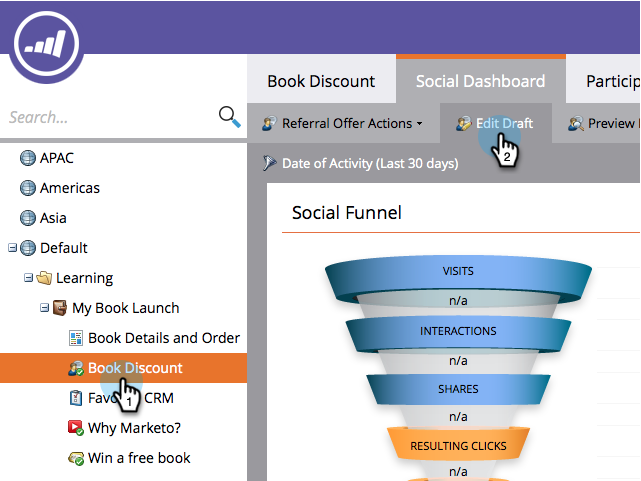
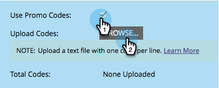

# Utilizza codici promozionali per l’evasione dell’offerta {#use-promo-codes-for-offer-fulfillment}

Quando crei un&#39;offerta di riferimento o una puntata, puoi inviare un codice promozionale (coupon) a ciascun vincitore. Per riscattare il premio, utilizzano il codice, ad esempio, nella pagina di pagamento di un acquisto sul sito.

## Carica codici promozionali {#upload-promo-codes}

1. Vai a **Attività di marketing**.

   

1. Seleziona l’offerta di riferimento e fai clic su **Modifica bozza**.

   

1. Nell’editor delle offerte di riferimento, vai a **Impostazioni app** e poi **Dettagli offerta**.

   

1. In E-mail, seleziona **Usa codici promozionali**, e in Carica codici, fai clic su **Sfoglia** per selezionare il file dei codici promozionali dal sistema.

   

1. Il file dei codici promozionali deve essere un file di testo ASCII semplice con un codice per riga e un&#39;estensione txt. Ad esempio:

   

   >[!CAUTION]
   >
   >Eventuali spazi vuoti nel file dei codici promozionali vengono trattati come parte del codice su tale riga. Prestare particolare attenzione ad evitare spazi finali alla fine di ogni riga.

1. Una volta completato il caricamento, viene visualizzato il numero totale di codici caricati.

   

## Rivedi codici promozionali inviati {#review-sent-promo-codes}

Una volta che i partecipanti iniziano a guadagnare il premio della tua offerta, puoi vedere quali codici promozionali sono stati inviati a chi e quando.

>[!NOTE]
>
>Solo gli utenti di Marketo con _Riconoscimenti accesso_ hanno accesso a queste informazioni. Consulta  [Gestione di ruoli utente e autorizzazioni](/help/marketo/product-docs/administration/users-and-roles/managing-user-roles-and-permissions.md).

1. Vai a **Attività di marketing**.

   

1. Seleziona l’offerta o le puntate di riferimento e fai clic sul pulsante **Partecipanti** scheda.

   

1. Qui dovresti vedere alcune voci. Fai clic sul numero in **Codici promozionali** per visualizzare i codici promozionali inviati al partecipante e quando.

   
