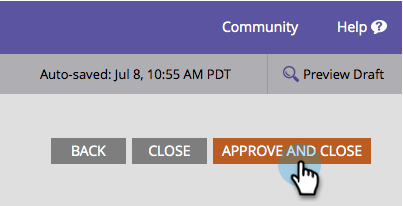

# Crea i tuoi Sweepstakes {#create-sweepstakes}

Una medaglia dà alle persone la possibilità di vincere un premio in cambio di raccontare ai loro amici di voi. Puoi rilasciarlo sulle pagine di destinazione, sul sito web e persino su Facebook.

>[!AVAILABILITY]
>
>Non tutti i clienti hanno acquistato questa funzionalità. Contatta il tuo rappresentante commerciale per i dettagli.

1. All&#39;interno del programma, seleziona **Nuovo** > **Nuova risorsa locale**.

   

1. In Raccolta risorse locale, fai clic su **Laghi**.

   

1. Dai un nome ai tuoi dolci.

   

   >[!TIP]
   >
   >Per risparmiare tempo, è possibile utilizzare **Clona da** per copiare tutte le impostazioni da una sweep esistente.

   L’editor dei sweep si apre in una nuova finestra. Le impostazioni predefinite sono tutte corrette, ma è comunque necessario configurare alcuni dettagli. Come nei passaggi successivi.

1. Fai clic su **Dettagli**.

   

1. Seleziona la frequenza, le date di inizio e di fine e il tuo fuso orario.

   

   >[!NOTE]
   >
   >Per i disegni giornalieri e settimanali, gli orari di inizio e di fine sono fissati rispettivamente alle 12.00 e alle 11.59. Per un disegno una tantum, potete scegliere i vostri tempi di inizio e di fine.

1. Fai clic su **Opzioni avanzate**.

   

1. Aggiungi un collegamento alle regole dei tuoi sweep. Inserisci l’URL. Questo collegamento è obbligatorio.

   

   Il collegamento verrà visualizzato nella parte inferiore delle schermate dei messaggi condivisi.

   >[!NOTE]
   >
   >In questa schermata puoi anche aggiungere un collegamento all’informativa sulla privacy. Vedi [Aggiungere l&#39;informativa sulla privacy a un&#39;app Social](/help/marketo/product-docs/demand-generation/social/social-functions/add-your-privacy-policy-to-a-social-app.md).

1. Fai clic su **Fine**.

   

1. Fai clic su **Approva e chiudi**.

   

   >[!TIP]
   >
   >Per modificare uno dei valori predefiniti nella sweep, fai clic su **Indietro**. Per salvare il lavoro per un momento successivo senza approvare, fare clic su **Chiudi**.

Se ci sono problemi nella posta in gioco, vi verrà chiesto di affrontarli prima che la posta in gioco sia approvata.

Complimenti. Hai creato una posta in gioco.

>[!MORELIKETHIS]
>
>Il passaggio successivo consiste nel [pubblicare i tuoi dolci](/help/marketo/product-docs/demand-generation/social/sweepstakes/publish-a-sweepstakes.md), ma puoi modificare l&#39;aspetto e le impostazioni delle tue azioni. Inizia con [personalizzazione degli stili della sweep](/help/marketo/product-docs/demand-generation/social/sweepstakes/customize-sweepstakes-styles.md).
