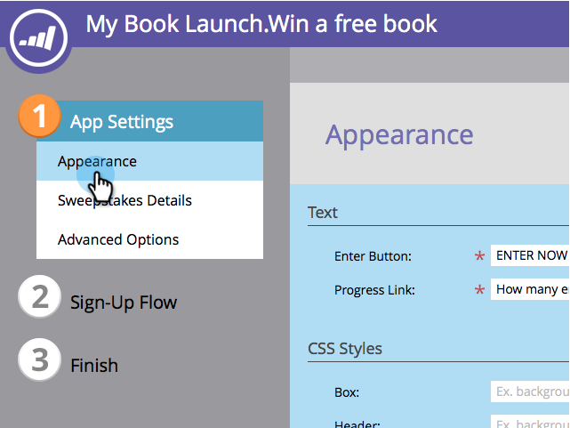
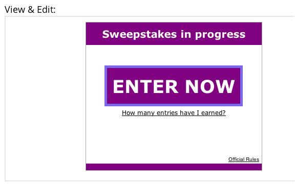

# Personalizzare gli stili degli sweep {#customize-sweepstakes-styles}

Quando [creare una sweep](/help/marketo/product-docs/demand-generation/social/sweepstakes/create-sweepstakes.md), puoi personalizzare l’aspetto della pagina di destinazione.

>[!AVAILABILITY]
>
>Non tutti i clienti hanno acquistato questa funzionalità. Contatta il tuo rappresentante commerciale per i dettagli.

1. Vai a **Attività di marketing**.

1. Seleziona la posta in gioco e fai clic su **Modifica bozza**.

   

1. Nell&#39;editor Sweepstakes, vai a **Impostazioni app** > **Aspetto**.

   

1. Modifica il testo del pulsante di registrazione e il collegamento di avanzamento.

   

1. Per ogni elemento che desideri personalizzare, immetti le proprietà CSS personalizzate.

   

   Esempio di CSS per **Pulsante Invio**:
   `<pre>border: 5px solid #7B68EE; background-color: purple; padding: 10px; font: 16px; color: #FFFFFF; text-align: center;</pre>`

   Immagine di esempio per **Pulsante Invio**:
   `<pre>background:url(https://app.marketo.com/images/public-site/button_sign-up-now.png) no-repeat center center; width:275px; height:95px; margin:auto; display:block;</pre>` `<pre>`

   >[!NOTE]
   >
   >Se utilizzi un’immagine con testo su di essa, ricorda di rimuovere il testo dal **Pulsante Invio** campo sotto Testo sopra.

1. Man mano che apporti ogni modifica, il risultato viene visualizzato nell’anteprima Visualizza e modifica .

   

   >[!NOTE]
   >
   >Testa il pulsante in diversi browser, incluse le versioni precedenti.

   >[!MORELIKETHIS]
   >
   >Il passaggio successivo consiste nell’aggiungere [e-mail di iscrizione e di evasione per i vostri dolci](/help/marketo/product-docs/demand-generation/social/social-functions/use-emails-in-social-promotions.md).
