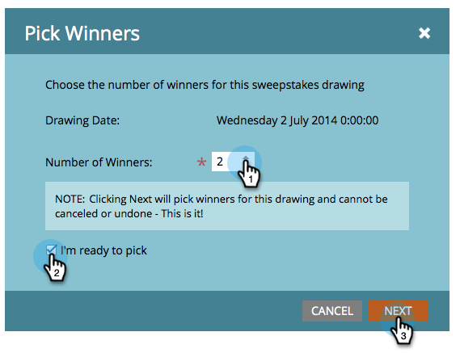

# Selezionare i vincitori di Sweepstakes {#select-sweepstakes-winners}

Quando [pubblicare una sweep](/help/marketo/product-docs/demand-generation/social/sweepstakes/publish-a-sweepstakes.md), è necessario selezionare i vincitori per ogni disegno. Quando lo fai, il tuo [e-mail di evasione](/help/marketo/product-docs/demand-generation/social/social-functions/use-emails-in-social-promotions.md) viene loro inviato automaticamente.

>[!AVAILABILITY]
>
>Non tutti i clienti hanno acquistato questa funzionalità. Contatta il tuo rappresentante commerciale per i dettagli.

1. Vai a **Attività di marketing**.

   

1. Seleziona la tua torta.

   

1. Fai clic su **Scegli vincitori**.

   

   >[!TIP]
   >
   >Per visualizzare un elenco delle persone che si sono iscritte per i tuoi dolci, fai clic sul pulsante **Partecipanti** scheda .

1. Scegli il numero di vincitori, seleziona **Sono pronto a scegliere** e fai clic su **Successivo**.

   

   >[!NOTE]
   >
   >Se si sceglie 0 vincitori per un disegno specifico, tali informazioni non vengono visualizzate nel **Vincitori** scheda .

1. Fai clic su **Finalizza** per inviare [e-mail di evasione](/help/marketo/product-docs/demand-generation/social/referral-offers/send-referral-offer-fulfillment-email.md) ai vincitori elencati.

   

   >[!NOTE]
   >
   >È possibile squalificare i vincitori prima di fare clic su Finalize (Finalizza). Se lo fai, sono comunque idonei per altri disegni in questa sweep.

Complimenti. Hai completato questa esecuzione della tua offerta Sweepstakes, scelto i vincitori casuali e inviato loro notifiche e-mail.
