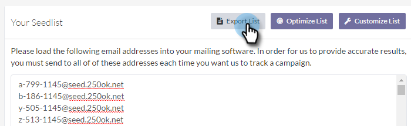

# Power Pack di recapito messaggi e-mail: Come importare un elenco di sementi {#email-deliverability-power-pack-how-to-import-a-seedlist}

Un elenco di seed è un elenco di account e-mail in più provider di cassette postali, tra cui Google Apps, Hotmail, Yahoo!, ecc, che vengono utilizzati per approssimare il tasso di consegna della cartella Posta in arrivo rispetto a quella della cartella spam. Ecco come ottenere quell’elenco nella tua istanza di Marketo.

>[!AVAILABILITY]
>
>Non tutti i clienti hanno acquistato questa funzionalità. Per ulteriori informazioni, contattare il rappresentante commerciale.

## Importare un elenco di sementi {#import-a-seedlist}

1. In My Marketo, seleziona **Strumenti di consegna**.

   

1. Fai clic su **Inviatore casella in entrata**.

   

1. Fai clic su **Get Seedlist**.

   

1. Fai clic su **Esporta elenco**.

   

   >[!NOTE]
   >
   >Scegli **Elenco di ottimizzazione** se si desidera 250ok [ottimizzare l&#39;elenco](https://help.returnpath.com/hc/en-us/articles/360046746451-What-is-250ok-s-seedlist-optimizer-and-why-should-I-use-it-) per te. Scegli **Personalizza elenco** se si desidera selezionare le aree dell’elenco di siti da includere.

1. Dopo l’esportazione, l’elenco verrà visualizzato come file .txt nella cartella dei download del browser. Recuperarlo e [importare](/help/marketo/getting-started/quick-wins/import-a-list-of-people.md) nella tua istanza Marketo come elenco statico.

   

   >[!TIP]
   >
   >Assicurati di assegnare un nome alla tua lista in modo da renderla facile da trovare.

   >[!CAUTION]
   >
   >Puoi ottenere una quantità limitata di queste campagne informative Posta in arrivo al mese. Per vedere quanti ne ottieni, guarda nel tuo 250ok **Impostazioni account**. Per ottenere di più, contatta il tuo rappresentante commerciale Marketo.

## Acquisizione di nuovi elenchi di siti {#acquiring-new-seedlists}

La tua lista dei semi può cambiare spesso come ogni mese. È importante accedere regolarmente a Email Deliverability Power Pack e controllare lo stato dell’elenco di seed. Quando vengono aggiunti nuovi indirizzi o è necessario un aggiornamento, viene visualizzato un avviso tramite l’interfaccia nella pagina Get Seedlist .

Dopo aver creato l’elenco statico in Marketo, puoi iniziare a inviarlo per testare il posizionamento della casella in entrata dell’e-mail.
