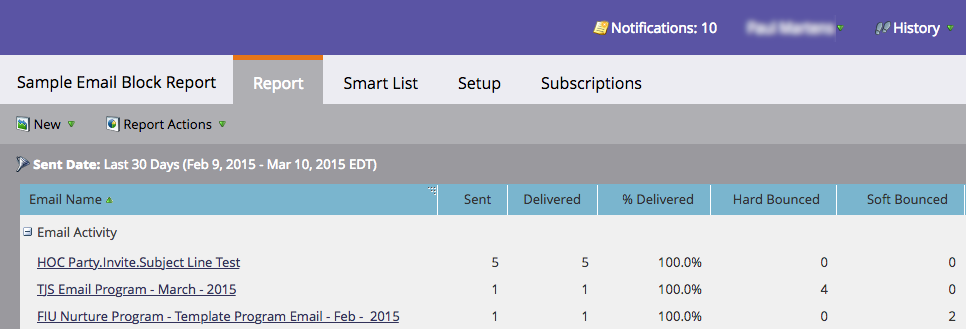

# Mancati recapiti permanenti e non permanenti nelle e-mail {#hard-and-soft-bounces-in-email}

Un mancato recapito permanente può rendere non valido l’indirizzo e-mail di una persona quando un server di posta comunica a Marketo che l’e-mail della persona non può essere consegnata. Un mancato recapito non permanente indica che si è verificato un errore durante la consegna dell’e-mail alla persona. L’errore si risolve automaticamente e a volte può richiedere alcuni giorni. I mancati recapiti permanenti e non permanenti sono costituiti da [più categorie](https://nation.marketo.com/t5/Knowledgebase/Maintaining-a-Directory-of-Leads-Bouncing-Emails/ta-p/300838).

## Classificazione per mancato recapito {#bounce-classification}

In Marketo sono disponibili 5 campi per persona relativi alla consegna di e-mail con problemi.

1. **E-mail sospesa** - Impostato su True quando si verifica un determinato tipo di mancato recapito.
1. **Causa di sospensione dell&#39;e-mail** - I motivi possono essere molteplici. Questo campo cerca di spiegare la causa.
1. **E-mail sospesa alle** - Quando si verifica il mancato recapito illecito, Marketo sospenderà l&#39;invio di e-mail alla persona per 24 ore da questa marca temporale.
1. **E-mail non valida** - Impostato su True quando si verifica un determinato tipo di messaggio non recapitato.
1. **Causa e-mail non valida** - Motivo dell&#39;interruzione definitiva.

>[!NOTE]
>
>Quando una persona raggiunge lo stato **e-mail sospesa**, non è possibile deselezionare la casella di controllo e-mail sospesa. Tuttavia, la persona sarà ancora disponibile per la posta 24 ore dopo la sospensione iniziale.
>
>Quando una persona è contrassegnata come **e-mail non valida**, può essere reimpostata solo manualmente (opzione consigliata solo se l&#39;indirizzo e-mail è stato confermato come valido) deselezionando la casella &quot;E-mail non valida&quot; nella scheda Informazioni persona del record.

>[!PREREQUISITES]
>
>Segui [questi passaggi](/help/marketo/product-docs/email-marketing/email-programs/email-program-data/email-performance-report.md) per creare un report sulle prestazioni delle e-mail, che genererà i dati non recapitati.

Dopo aver creato il rapporto sulle prestazioni delle e-mail, lo schermo dovrebbe essere simile al seguente:

>[!NOTE]
>
>I filtri anti-spam a volte creano mancati recapiti permanenti. Questi &quot;falsi positivi&quot; non sono un’indicazione della vera validità dell’indirizzo e-mail della persona.
