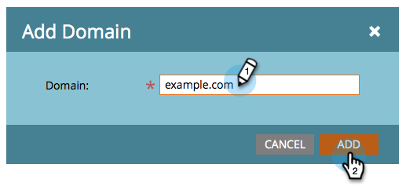

# Imposta una firma DKIM personalizzata {#set-up-a-custom-dkim-signature}

Al fine di garantire il recapito messaggi di primo livello, firmiamo automaticamente tutti i messaggi in uscita con una firma Marketo DKIM condivisa.

>[!NOTE]
>
>Potrebbe essere necessario l&#39;aiuto del team IT per completare alcuni dei passaggi descritti in questo articolo.

Puoi personalizzare la firma DKIM in modo da riflettere i domini selezionati. Ecco come.

1. Vai a **Amministratore** sezione .

   

   >[!NOTE]
   >
   >Se si imposta una firma DKIM personalizzata nel modo precedente, continuerà a funzionare e dovrebbe comparire qui.

1. Fai clic su **E-mail**, quindi **DKIM** e infine **Aggiungi dominio**.

   

1. Immetti il dominio che utilizzerai nelle e-mail di Marketo come indirizzo Da e fai clic su **Aggiungi**.

   >[!TIP]
   >
   >Se utilizzi un dominio diverso nell’indirizzo Da, utilizzeremo la firma DKIM condivisa di Marketo.

   

1. Invia **Record host** e **Valore TXT** all&#39;IT. Chiedi loro di creare il record per te e assicurati che si propaghi a tutti i server dei nomi associati al dominio da. La verifica DKIM di Marketo richiede che la chiave DKIM venga propagata a tutti i server dei nomi associati al dominio firmato da DKIM.

   

1. Dopo aver confermato di aver creato il record, torna a Marketo, seleziona il dominio e fai clic su **Controlla DNS**.

   

   >[!NOTE]
   >
   >Se la conferma non riesce e l&#39;IT ha creato correttamente il record, potrebbe trattarsi di una questione di propagazione DNS. Riprova più tardi.

   >[!CAUTION]
   >
   >La modifica/rimozione del record DNS corrispondente causerà un danneggiamento del recapito messaggi. Assicurati di eliminare la voce in Marketo prima di apportare modifiche DNS.

   Questo ti aiuterà assolutamente con il recapito messaggi e-mail. È necessario ottenere la convalida della presenza del record e della relativa correzione.
