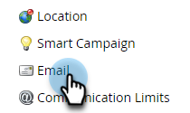

# Configurare una firma DKIM personalizzata {#set-up-a-custom-dkim-signature}

Per garantire un recapito messaggi di prima qualità, firmiamo automaticamente tutti i messaggi in uscita con una firma Marketo DKIM condivisa.

>[!NOTE]
>
>Potrebbe essere necessario l’aiuto del team IT per completare alcuni dei passaggi descritti in questo articolo.

Puoi personalizzare la firma DKIM per riflettere i domini selezionati. Ecco come.

1. Passare alla sezione **[!UICONTROL Admin]**.

   

   >[!NOTE]
   >
   >Se imposti una firma DKIM personalizzata secondo la vecchia modalità, questa continuerà a funzionare e dovrebbe essere visualizzata qui.

1. Fai clic su **E-mail**.

   

1. Fare clic sulla scheda **SPF/DKIM**, quindi **Aggiungi dominio**.

   

1. Immetti il dominio che utilizzerai nelle e-mail Marketo come Indirizzo mittente. Scegli un selettore e una dimensione chiave. Al termine, fai clic su **Aggiungi**.

   

   <table>
   <tr>
   <td width="20%"><b>Selettore</b></td>
   <td>Stringa o identificatore univoco utilizzato per individuare la parte della chiave pubblica del record DKIM. Può trattarsi di una stringa arbitraria o di un identificatore univoco per separare e identificare lo scopo di tale chiave/record DKIM.</td>
   </tr>
   <tr>
   <td width="20%"><b>Dimensione chiave</b></td>
   <td>Livello di protezione con cui crittografare la firma DKIM.</td>
   </tr>
   </tbody>
   </table>

   

   >[!TIP]
   >
   >* È consigliabile impostare la dimensione della chiave su 2048.
   >* Se utilizzi un dominio diverso nell’indirizzo Da, verrà utilizzata la firma DKIM condivisa di Marketo.

   >[!IMPORTANT]
   >
   >Se è necessario aggiornare il selettore DKIM o la dimensione di crittografia DKIM per il dominio, è necessario eliminare il record esistente e ripubblicare il record appena generato con i nuovi valori.
   >
   >Si prega di notare che quando si esegue questa operazione, DKIM non verrà firmato per il dominio fino a quando il nuovo record non verrà pubblicato e convalidato dal sistema. Pianifica le modifiche di conseguenza, poiché potrebbero essere necessarie da 24 a 48 ore prima che il nuovo record DKIM venga completamente propagato su Internet.

1. Invia **[!UICONTROL Host Record]** e **[!UICONTROL TXT Value]** al tuo IT. Chiedere loro di creare il record e assicurarsi che venga propagato a tutti i server dei nomi associati al dominio di origine. La verifica DKIM di Marketo richiede che la chiave DKIM venga propagata a tutti i server dei nomi associati al dominio con firma DKIM.

   

1. Dopo aver confermato la creazione del record, tornare a Marketo, selezionare il dominio e fare clic su **[!UICONTROL Check DNS]**.

   

   >[!NOTE]
   >
   >Se la conferma non riesce e il reparto di IT ha creato correttamente il record, potrebbe trattarsi di una questione di propagazione DNS. Riprova più tardi.

   >[!CAUTION]
   >
   >La modifica o la rimozione del record DNS corrispondente compromette il recapito messaggi. Assicurati di eliminare la voce in Marketo prima di apportare modifiche DNS.

   Questo ti sarà di grande aiuto per il recapito dei messaggi e-mail. Dovresti ottenere la convalida che il record sia presente e corretto.
