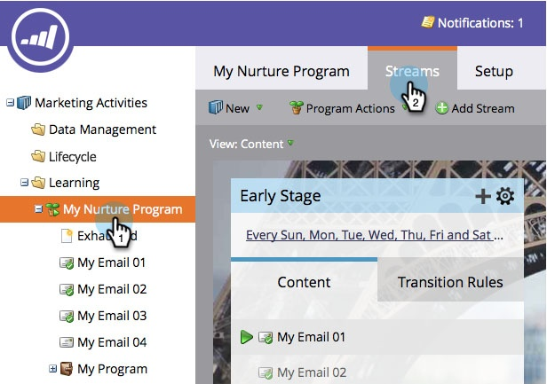

# Aggiungere un flusso {#add-a-stream}

I programmi di coinvolgimento possono contenere più flussi. Ecco come aggiungerne uno nuovo.

1. Passa a **[!UICONTROL Marketing Activities]**.

   

1. Selezionare il programma di coinvolgimento e fare clic sulla scheda **[!UICONTROL Streams]**.

   

1. Fai clic su **[!UICONTROL Add Stream]**.

   

   >[!NOTE]
   >
   >Puoi aggiungere fino a 25 flussi per programma di coinvolgimento.

   E... fatto!

   
