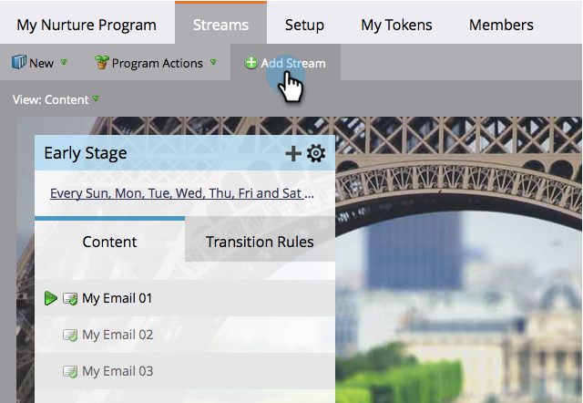

# Aggiungere un flusso {#add-a-stream}

I programmi di coinvolgimento possono contenere più di un flusso. Ecco come aggiungerne una nuova.

1. Andate a **Marketing Activities**.

   

1. Selezionate il programma di coinvolgimento e fate clic sulla scheda **Streams**.

   

1. Fare clic su **Aggiungi flusso**.

   

   >[!NOTE]
   >
   >Puoi aggiungere fino a 25 flussi per programma di coinvolgimento.

   E... fatto!

   
