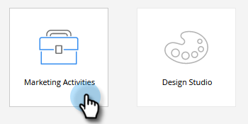
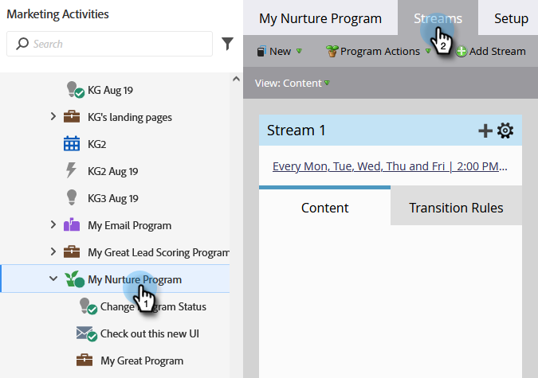

# Aggiungere contenuto a un flusso {#add-content-to-a-stream}

Dopo aver creato il programma di coinvolgimento, devi aggiungere dei contenuti ai flussi. Puoi aggiungere e-mail o programmi a un flusso.

1. Vai a **Attività di marketing**.

   

1. Seleziona il programma di coinvolgimento e vai alla scheda **Streams** .

   

   Puoi aggiungere il contenuto in due modi diversi:

**Pulsante Aggiungi contenuto**

1. Fai clic sul pulsante **Aggiungi contenuto** .

   

1. Scegli **E-mail** _o_ **Programma**, quindi seleziona l&#39;e-mail o il programma/campagna intelligente che desideri aggiungere.

   

   >[!TIP]
   >
   >Le e-mail locali a questo programma di coinvolgimento saranno ordinate in alto.

**Icona +**

1. Fai clic sull&#39;icona **+**, scegli **E-mail** _o_ **Programma**, quindi seleziona l&#39;e-mail o il programma/campagna intelligente che desideri aggiungere.

   

   >[!NOTE]
   >
   >Per il corretto funzionamento di una campagna intelligente deve contenere il filtro **Membro del programma di coinvolgimento** .

Ottimo lavoro! Ora sai come aggiungere contenuti ai flussi di programmi. Aggiungi tutto il necessario per la tua nutrizione. Per ulteriori informazioni, consulta il relativo articolo di seguito.

>[!MORELIKETHIS]
>
>[Aggiunta di un programma a un flusso del programma di coinvolgimento](/help/marketo/product-docs/email-marketing/drip-nurturing/creating-an-engagement-program/adding-a-program-to-an-engagement-program-stream.md)
