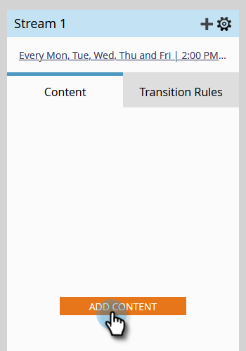

# Aggiungere contenuto a un flusso {#add-content-to-a-stream}

Dopo aver creato il programma di coinvolgimento, devi aggiungere il contenuto ai flussi. Puoi aggiungere e-mail o programmi a un flusso.

1. Vai a **[!UICONTROL Marketing Activities]**.

   

1. Selezionare il programma di coinvolgimento e passare alla scheda **[!UICONTROL Streams]**.

   

   È possibile aggiungere contenuto in due modi diversi:

**Pulsante Aggiungi contenuto**

1. Fare clic sul pulsante **[!UICONTROL Add Content]**.

   

1. Scegli **[!UICONTROL Email]** _o_ **[!UICONTROL Program]**, quindi seleziona l&#39;e-mail o il programma/smart campaign che desideri aggiungere.

   

   >[!TIP]
   >
   >Le e-mail locali a questo programma di coinvolgimento saranno ordinate in alto.

Icona **+**

1. Fai clic sull&#39;icona **+**, scegli **[!UICONTROL Email]** _or_ **[!UICONTROL Program]**, quindi seleziona l&#39;e-mail o il programma/smart campaign che desideri aggiungere.

   

   >[!NOTE]
   >
   >Una campagna avanzata deve contenere il filtro **[!UICONTROL Member of Engagement Program]** per funzionare correttamente.

Ottimo lavoro! Ora sai come aggiungere contenuti ai flussi del programma. Aggiungete tutto il necessario per la vostra coltura. Per ulteriori informazioni, consulta l’articolo correlato riportato di seguito.

>[!MORELIKETHIS]
>
>[Aggiunta di un programma a un flusso di programma di coinvolgimento](/help/marketo/product-docs/email-marketing/drip-nurturing/creating-an-engagement-program/adding-a-program-to-an-engagement-program-stream.md)
