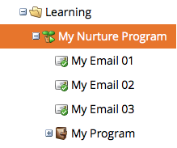

# Informazioni sui programmi di coinvolgimento {#understanding-engagement-programs}

I programmi di coinvolgimento sono progettati per raggiungere nuove persone presentando loro contenuti in modo sistematico.

>[!NOTE]
>
>È previsto un limite di 100 programmi di coinvolgimento **attivi** per abbonamento.

## Programma di coinvolgimento {#engagement-program}

Un **programma di coinvolgimento** è un tipo di programma in grado di gestire con facilità attività di nurturing complesse.

>[!MORELIKETHIS]
>
>[Creare un programma di coinvolgimento](/help/marketo/product-docs/email-marketing/drip-nurturing/creating-an-engagement-program/create-an-engagement-program.md)

## Flusso {#stream}

Un **flusso** è un pool di contenuti organizzati per priorità che il programma di coinvolgimento utilizzerà per il nurturing delle persone.

>[!MORELIKETHIS]
>
>* [Aggiungere un flusso](/help/marketo/product-docs/email-marketing/drip-nurturing/creating-an-engagement-program/add-a-stream.md)
>* [Clonare un flusso](/help/marketo/product-docs/email-marketing/drip-nurturing/engagement-program-streams/clone-a-stream.md)

## Contenuti {#content}

Esistono due tipi di **contenuti** che puoi aggiungere ai flussi di un programma di coinvolgimento: le e-mail e i programmi. Le e-mail verranno inviate alle persone al momento del cast.

>[!MORELIKETHIS]
>
>* [Aggiungere contenuti a un flusso](/help/marketo/product-docs/email-marketing/drip-nurturing/creating-an-engagement-program/add-content-to-a-stream.md)
>* [Assegnare priorità ai contenuti del flusso](/help/marketo/product-docs/email-marketing/drip-nurturing/using-stream-content/prioritize-stream-content.md)
>* [Modificare la disponibilità dei contenuti del flusso](/help/marketo/product-docs/email-marketing/drip-nurturing/using-stream-content/edit-availability-of-stream-content.md)
>* [Rimuovere i contenuti dal flusso](/help/marketo/product-docs/email-marketing/drip-nurturing/using-stream-content/remove-stream-content.md)
>* [Archiviazione e annullamento dell’archiviazione dei contenuti del flusso](/help/marketo/product-docs/email-marketing/drip-nurturing/using-stream-content/archive-and-unarchive-stream-content.md)

## Cast {#cast}

Un **cast** è l’evento di invio delle e-mail da un programma di coinvolgimento.

>[!NOTE]
>
>I programmi di coinvolgimento non sono progettati per essere utilizzati con le e-mail operative.

## Cadenza del flusso {#stream-cadence}

Puoi decidere quando si verifica un cast impostando **cadenza flusso**. In questo modo pianifichi l’invio dei contenuti a intervalli regolari.

>[!MORELIKETHIS]
>
>[Impostare la cadenza del flusso](/help/marketo/product-docs/email-marketing/drip-nurturing/engagement-program-streams/set-stream-cadence.md)

## Cadenza della persona {#person-cadence}

Una **cadenza della persona** è uno stato che definisce la sua idoneità a ricevere contenuti da un programma di coinvolgimento. Puoi utilizzare il passaggio del flusso **[!UICONTROL Change Engagement Program Cadence]** per cambiarla in [!UICONTROL Paused] o [!UICONTROL Normal].

## Exhausted (Esaurita) {#exhausted}

Una volta che una persona ha ricevuto ogni singolo contenuto presente in un flusso, viene definita **Exhausted** (Esaurita).

>[!MORELIKETHIS]
>
>[Persone che hanno esaurito i contenuti](/help/marketo/product-docs/email-marketing/drip-nurturing/using-engagement-programs/people-who-have-exhausted-content.md)

## Livello di coinvolgimento dei contenuti {#content-engagement-level}

Il livello di coinvolgimento dei contenuti è un punteggio da 0 a 100 che Marketo assegnerà ai tuoi contenuti. Questo numero è determinato da una formula complessa che utilizza aperture, clic, annullamenti delle iscrizioni, completamento del programma e altri fattori.

>[!MORELIKETHIS]
>
>[Informazioni sul punteggio di coinvolgimento](/help/marketo/product-docs/email-marketing/drip-nurturing/reports-and-notifications/understanding-the-engagement-score.md)
