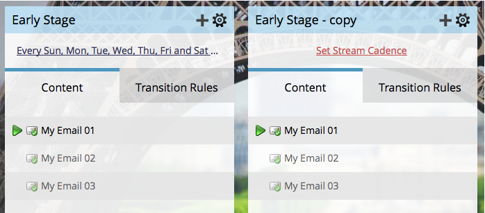

# Clonare un flusso {#clone-a-stream}

Clona un flusso per vari motivi, tra cui la verifica di diversi ordini e cadenze diverse.

1. Selezionare il programma di coinvolgimento e passare alla scheda **[!UICONTROL Streams]**.

   

1. Fai clic sull&#39;icona dell&#39;ingranaggio di flusso, quindi fai clic su **[!UICONTROL Clone]**.

   

   >[!NOTE]
   >
   >Puoi avere fino a 25 flussi per programma di coinvolgimento.

   Ben fatto! Non ti piacciono le cose che ti rendono la vita più facile?

   

   >[!CAUTION]
   >
   >Tutto il contenuto del flusso viene clonato ad eccezione della Cadenza. Ricordati di impostarlo.
