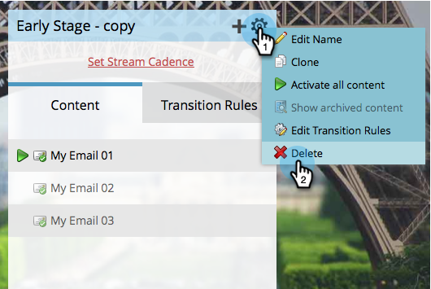
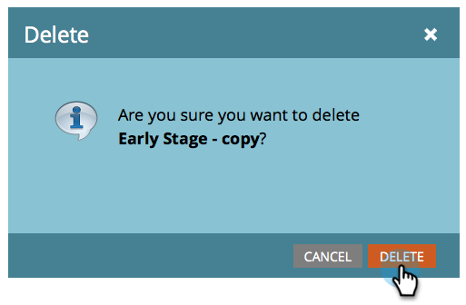

# Eliminare un flusso {#delete-a-stream}

Se hai bisogno di eliminare un flusso dal tuo programma di coinvolgimento, segui questi passaggi rapidi e facili.

1. Vai a **Attività di marketing**.

   

1. Seleziona il tuo programma di coinvolgimento e vai a **Flussi**.

   

   >[!CAUTION]
   >
   >L&#39;eliminazione di un flusso comporterà la perdita di dati storici per il contenuto di tale flusso.

1. Fai clic sull’icona a forma di ingranaggio e seleziona **Elimina**.

   

1. Conferma l’eliminazione facendo clic su **Elimina**.

   

   >[!NOTE]
   >
   >Se il flusso contiene persone, ti verrà chiesto di [spostare](/help/marketo/product-docs/core-marketo-concepts/smart-campaigns/program-flow-actions/change-engagement-program-stream.md) per primi.
