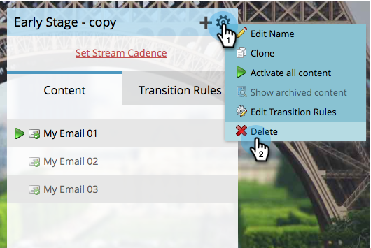
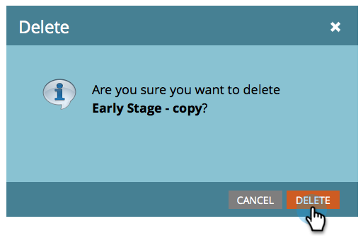

# Eliminare un flusso {#delete-a-stream}

Se hai bisogno di eliminare un flusso dal programma di coinvolgimento, segui questi passaggi rapidi e semplici.

1. Passa a **[!UICONTROL Marketing Activities]**.

   

1. Selezionare il programma di coinvolgimento e passare a **[!UICONTROL Streams]**.

   

   >[!CAUTION]
   >
   >L’eliminazione di un flusso determinerà la perdita di dati storici per il contenuto in quel flusso.

1. Fare clic sull&#39;icona a forma di ingranaggio e selezionare **[!UICONTROL Delete]**.

   

1. Confermare l&#39;eliminazione facendo clic su **[!UICONTROL Delete]**.

   

   >[!NOTE]
   >
   >Se nel flusso sono presenti persone, ti verrà chiesto di [spostarle](/help/marketo/product-docs/core-marketo-concepts/smart-campaigns/program-flow-actions/change-engagement-program-stream.md) prima.
