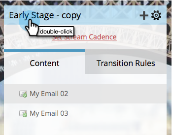
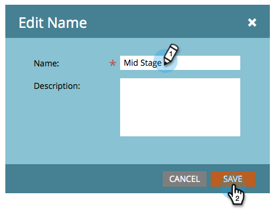

# Rinominare un flusso {#rename-a-stream}

Se desideri rimanere organizzato, puoi rinominare i flussi.

1. Trovare e selezionare il programma di coinvolgimento, quindi fare clic su **[!UICONTROL Streams]**.

   

1. Fare doppio clic sul nome del flusso corrente.

   

1. Immettere il nuovo flusso **[!UICONTROL Name]** e fare clic su **[!UICONTROL Save]**.

   
