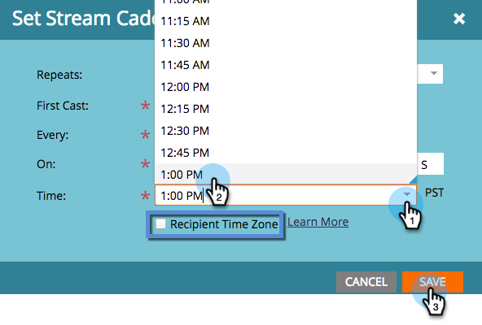

# Imposta cadenza flusso {#set-stream-cadence}

Puoi inviare il contenuto del coinvolgimento in qualsiasi intervallo. Ad esempio: una volta alla settimana o un martedì al terzo del mese.

## Imposta cadenza {#set-cadence}

1. Vai a **Attività di marketing**.

   

1. Individuare e selezionare il programma di coinvolgimento, fare clic su **Flussi** , quindi fai clic su **Imposta cadenza flusso**.

   

1. Selezionare la frequenza con cui si desidera che la cadenza ricorra. Puoi scegliere **Ogni settimana** o **Mensile**.

## Settimanale {#weekly}

1. Seleziona **Ogni settimana**.

   

   >[!NOTE]
   >
   >Selezione **Nessuno** arresterà il flusso.

1. Scegliete la data del primo cast.

   

1. Ora scegli se vuoi che la cadenza avvenga ogni settimana o più distanziata. Scegliamo ogni due settimane.

   

1. Decidi quali giorni della settimana. In questo caso facciamo martedì, mercoledì e giovedì.

   

   >[!TIP]
   >
   >Puoi impostare la cadenza in modo che venga eseguita ogni giorno scegliendo **Ripetizioni: settimanali** / **Ogni: 1 settimana** / **On**: tutti i giorni.

   Ora scegli l’Ora. Seleziona la casella se desideri utilizzare [Fuso orario destinatario](/help/marketo/product-docs/email-marketing/drip-nurturing/engagement-program-streams/set-stream-cadence/schedule-engagement-programs-with-recipient-time-zone.md)(ovvero consegnare in base ai fusi orari locali), quindi fare clic su **Salva**.

   

   >[!CAUTION]
   >
   >Il contenuto verrà pubblicato nella data selezionata per il primo cast, quindi assicurati che coincida con il giorno della settimana scelto; altrimenti verrà distribuito due volte nella prima settimana.

1. Passa il cursore sopra la cadenza. Vedrai che giorno usciranno i cast futuri.

   

   >[!NOTE]
   >
   >In questo esempio, un’e-mail verrà inviata giovedì. Quindi saltiamo una settimana e inviamo di nuovo martedì, mercoledì e giovedì della settimana successiva. E poi ripetiamo il ciclo.

Tutto qui! Continua a leggere se vuoi impostare una cadenza mensile.

## Mensile {#monthly}

1. Seleziona **Mensile** per quanto spesso si ripete.

   

1. Scegliete la data del primo cast.

   

1. Seleziona questa opzione se desideri che sia ogni mese o più distanziato... Scegliamo ogni quattro mesi.

   

1. Scegliere il giorno del mese specificato, in questo caso il 22 di ogni quarto mese.

   

   >[!TIP]
   >
   >In alternativa, è possibile scegliere il giorno della settimana.

1. Scegli un **Ora** e fai clic su **Salva**.

   

1. Passa il cursore sopra la cadenza. Vedrai che giorno usciranno i cast futuri.

   

   >[!CAUTION]
   >
   >Se decidi di modificare la cadenza del flusso di coinvolgimento in un secondo momento, assicurati che il primo cast sia impostato su una data futura.

Ora sai come impostare una cadenza di flusso!

>[!MORELIKETHIS]
>
>* [Informazioni sul fuso orario del destinatario](/help/marketo/product-docs/email-marketing/email-programs/email-program-actions/scheduling-with-recipient-time-zone/understanding-recipient-time-zone.md)
>* [Programmi di pianificazione del coinvolgimento con fuso orario del destinatario](/help/marketo/product-docs/email-marketing/drip-nurturing/engagement-program-streams/set-stream-cadence/schedule-engagement-programs-with-recipient-time-zone.md)
