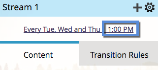

# Programmi di pianificazione del coinvolgimento con fuso orario del destinatario {#schedule-engagement-programs-with-recipient-time-zone}

Quando pianifichi un flusso di programma di coinvolgimento e il fuso orario del destinatario è attivo, il cast del programma inizierà a essere eseguito a mezzanotte nel primo fuso orario (UTC +14:00). Ti chiediamo di pianificare il primo cast **almeno 25 ore** in futuro, perché ci potrebbero essere persone che si qualificano per il cast in ogni fuso orario del mondo. L’avvio dell’elaborazione in questo momento in base al primo fuso orario garantisce la consegna dell’e-mail alla data e all’ora pianificate per ogni destinatario.

1. Nel programma di coinvolgimento, passare alla scheda **[!UICONTROL Streams]** e fare clic sulla pianificazione di cadenza di un flusso per modificarla.

   

1. [Imposta le impostazioni di cadenza](/help/marketo/product-docs/email-marketing/drip-nurturing/engagement-program-streams/set-stream-cadence.md) come di consueto, quindi seleziona la casella **[!UICONTROL Recipient Time Zone]**. Ricorda che il tuo primo cast deve durare almeno 25 ore in futuro. Fai clic su **[!UICONTROL Save]**.

   

1. Tieni presente che con il fuso orario del destinatario attivo, la pianificazione della cadenza non mostrerà un fuso orario specifico, in quanto potrebbero esserci più fusi orari. Verrà visualizzata solo l’ora.

   

>[!MORELIKETHIS]
>
>* [Informazioni sul fuso orario del destinatario](/help/marketo/product-docs/email-marketing/email-programs/email-program-actions/scheduling-with-recipient-time-zone/understanding-recipient-time-zone.md)
>* [Imposta cadenza flusso](/help/marketo/product-docs/email-marketing/drip-nurturing/engagement-program-streams/set-stream-cadence.md)
