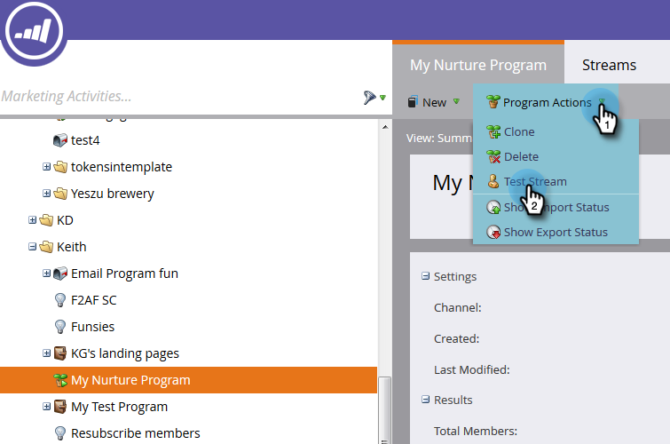

# Testare un flusso di coinvolgimento {#test-an-engagement-stream}

Dopo aver aggiunto tutti i contenuti a un flusso, puoi testarli un pezzo alla volta.

1. Passa a **[!UICONTROL Marketing Activities]**.

   

1. Seleziona il programma di coinvolgimento.

   

1. Fare clic su **[!UICONTROL Program Actions]** e selezionare **[!UICONTROL Test Stream]**.

   

1. Selezionare la persona desiderata dal menu a discesa **[!UICONTROL Test Person]**. Ricordate, il contenuto verrà effettivamente distribuito, quindi tenetelo presente quando scegliete.

   

   >[!CAUTION]
   >
   >Assicurati che la persona di prova sia univoca e non contenga duplicati nel database.

   >[!TIP]
   >
   >Se la persona di prova che stai cercando non esiste, utilizza l&#39;opzione **[!UICONTROL Create Person]** per crearne una al volo.

   Fare clic su **[!UICONTROL Initial Stream]**, selezionare il flusso che si desidera verificare e fare clic su **[!UICONTROL Run Cast]**.
   

1. Dopo aver eseguito le [regole di transizione](/help/marketo/product-docs/email-marketing/drip-nurturing/engagement-program-streams/transition-people-between-engagement-streams.md) precedentemente impostate, fare clic sull&#39;icona Aggiorna.

   

1. Verrà visualizzato il nuovo flusso, a indicare che il test è riuscito.

   

   Ottimo lavoro!

   >[!NOTE]
   >
   >Nessun altro contenuto verrà inviato a meno che non si faccia clic su **[!UICONTROL Run Cast again]**.
