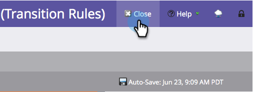

# Persone di transizione tra flussi di coinvolgimento {#transition-people-between-engagement-streams}

I programmi di coinvolgimento possono avere più di un flusso. Se [aggiungere un flusso](/help/marketo/product-docs/email-marketing/drip-nurturing/creating-an-engagement-program/add-a-stream.md), vuoi definire un modo per le persone di spostarsi da un flusso all&#39;altro. Si chiamano **regole di transizione.**

1. Vai a **Attività di marketing**.

   

1. Seleziona il tuo programma di coinvolgimento multi-streaming e vai a **Flussi**.

   

1. Fai clic su **Regole di transizione** per il flusso in cui si desidera estrarre da altri flussi, quindi fare clic su **Modifica regole di transizione**.

   

   >[!NOTE]
   >
   >Le regole di transizione entrano in un flusso; definisci sempre le regole del flusso in cui desideri effettuare il pull.

   Una volta aperta la finestra della regola di transizione, trova e trascina il trigger desiderato. In questo caso, vogliamo spostare le persone a Mid Stage quando viene aggiunto a un&#39;opportunità.

   

1. Imposta l’operatore su **è qualsiasi** in modo che le persone si spostino per ogni opportunità aggiuntiva.

   

   >[!TIP]
   >
   >Puoi aggiungere più attivatori e filtri a una regola di transizione, ma la regola di transizione utilizza tutti i filtri (l’uso di TUTTI i filtri è l’unica opzione). Se devi utilizzare l’operatore OR in una regola di transizione, ti consigliamo invece di impostare una campagna intelligente esterna.

1. Fai clic su **Chiudi**.

   

   Fantastico! Ora qualsiasi persona nel programma di coinvolgimento che viene aggiunta a un&#39;opportunità verrà spostata nel flusso Mid Stage.

   

   >[!NOTE]
   >
   >I passi sopra descritti *fare* si applicano alle persone che sono [in pausa](/help/marketo/product-docs/email-marketing/drip-nurturing/using-engagement-programs/pause-people-in-an-engagement-program.md) anche.
