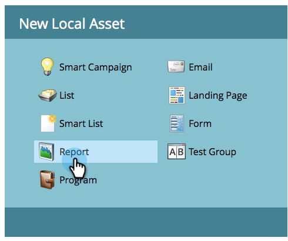
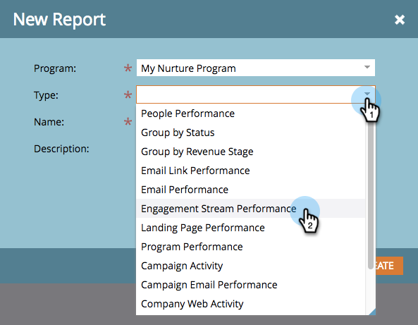

# Rapporto sulle prestazioni del flusso di coinvolgimento {#engagement-stream-performance-report}

Vuoi sapere come stanno andando i contenuti del tuo coinvolgimento? Prova il rapporto sulle prestazioni del flusso di coinvolgimento.

## Creare il rapporto {#create-the-report}

1. Trova e seleziona il tuo programma di coinvolgimento, quindi in **Nuovo** click **Nuova risorsa locale**.

   

1. Seleziona **Report**.

   

   >[!TIP]
   >
   >La creazione di un report in base al programma lo limiterà automaticamente al contenuto del programma.

   Selezionare Prestazioni flusso di coinvolgimento come tipo di report.
   

1. Assegna un nome al rapporto e fai clic su **Crea**.

   

   Va bene! Vediamo ora le impostazioni.

## Modifica impostazioni {#edit-settings}

1. Trova e seleziona il rapporto.

   

1. Sotto **Configurazione** , fare doppio clic sulla scheda **E-mail programma di coinvolgimento** filtro.

   

1. Seleziona le e-mail su cui vuoi creare il rapporto e fai clic su **Applica**.

   

## Esegui rapporto {#run-report}

1. Per eseguire il rapporto, fai clic sul pulsante **Report** scheda.

   

   >[!TIP]
   >
   >Anche se non illustrato, il punteggio di coinvolgimento è una colonna in questo rapporto. Consulta [Informazioni sul punteggio di coinvolgimento](/help/marketo/product-docs/email-marketing/drip-nurturing/reports-and-notifications/understanding-the-engagement-score.md) per i dettagli su cosa si tratta.

   Ottimo lavoro! Il report è raggruppato per programma di coinvolgimento.
