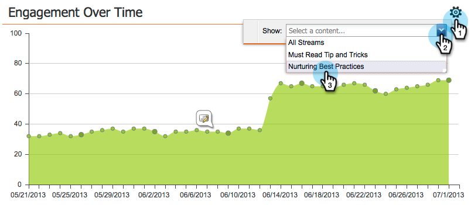

# Dashboard di coinvolgimento {#the-engagement-dashboard}

Il Dashboard di coinvolgimento è il modo più semplice per vedere le prestazioni del contenuto del programma di coinvolgimento.

>[!NOTE]
>
>Il punteggio di coinvolgimento include i dati degli ultimi tre cast. Una nuova viene calcolata 72 ore dopo ogni cast. Ulteriori informazioni sulle [punteggio di coinvolgimento](/help/marketo/product-docs/email-marketing/drip-nurturing/reports-and-notifications/understanding-the-engagement-score.md).

## Visualizza il dashboard di coinvolgimento {#view-the-engagement-dashboard}

Seleziona il programma di coinvolgimento e fai clic su **Visualizza** > **Dashboard**.

>[!TIP]
>
>Consulta la sezione [rapporto sulle prestazioni del flusso di lavoro di coinvolgimento](/help/marketo/product-docs/email-marketing/drip-nurturing/reports-and-notifications/engagement-stream-performance-report.md) per statistiche più dettagliate.

## Comprendere il Widget di esaurimento {#understand-the-exhaustion-widget}

Questo widget ti aiuta a prevedere quando i lead avranno esaurito tutto il contenuto. Il punteggio di esaurimento viene calcolato immediatamente dopo ogni cast. L’esempio seguente mostra che in 1 cast, 195 lead avranno esaurito tutto il contenuto.

>[!NOTE]
>
>Devi entrare nella scheda Configurazione e accertarti che le notifiche di contenuto con esaurimento siano **On** per visualizzare il grafico qui sopra. Se sono disattivati, il grafico avrà un aspetto diverso.

>[!CAUTION]
>
>Le persone &quot;esauste&quot; non riceveranno alcuna comunicazione nel prossimo cast.

## Comprendere il coinvolgimento nel tempo Widget {#understand-the-engagement-over-time-widget}

Mostra il punteggio medio di coinvolgimento nel tempo e l’impatto delle modifiche al contenuto.

>[!AVAILABILITY]
>
>Questa funzione è disponibile come componente aggiuntivo per i clienti che utilizzano Marketo Revenue Cycle Explorer. Per ulteriori informazioni, contatta il team dell&#39;account Adobe (il tuo Account Manager).

Per visualizzare un singolo contenuto invece che una media, fai clic sull’icona a forma di ingranaggio, quindi seleziona il contenuto.

## Comprendere il Widget di coinvolgimento più alto {#understand-the-highest-engagement-widget}

Un elenco di tutti i contenuti, ordinati in base al punteggio di coinvolgimento più elevato.

Per modificare l’ordinamento, fai clic sull’icona a forma di ingranaggio, quindi seleziona l’ordinamento.

_Più recente_ e _Oldest_ sono basati sull&#39;ora dell&#39;ultima approvazione.

>[!NOTE]
>
>Ulteriori informazioni nel [Creare un programma di coinvolgimento](/help/marketo/product-docs/email-marketing/drip-nurturing/creating-an-engagement-program/create-an-engagement-program.md) immersione profonda.
