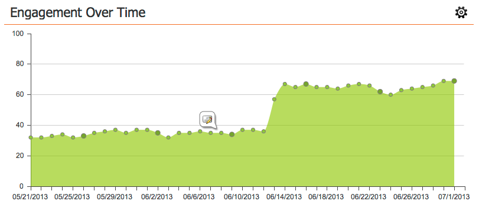
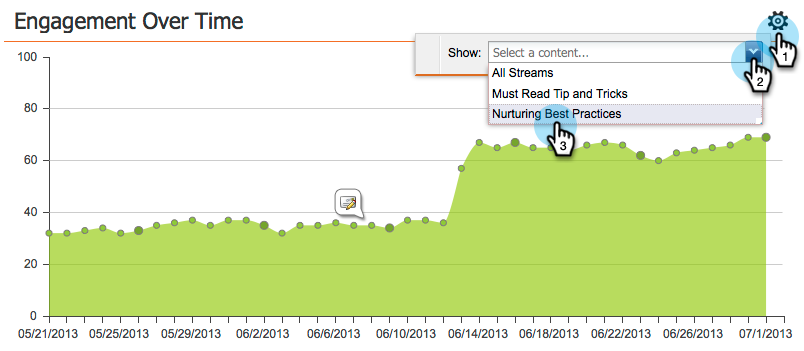

# Dashboard di coinvolgimento {#the-engagement-dashboard}

La dashboard di coinvolgimento è il modo più semplice per visualizzare le prestazioni del contenuto nel programma di coinvolgimento.

>[!NOTE]
>
>Il punteggio di coinvolgimento include i dati degli ultimi tre cast. Una nuova è calcolata 72 ore dopo ogni cast. Ulteriori informazioni sul [punteggio di coinvolgimento](/help/marketo/product-docs/email-marketing/drip-nurturing/reports-and-notifications/understanding-the-engagement-score.md).

## Visualizza dashboard di coinvolgimento {#view-the-engagement-dashboard}

Seleziona il programma di coinvolgimento e fai clic su **Visualizza** > **[!UICONTROL Dashboard]**.

>[!TIP]
>
>Per statistiche più dettagliate, consulta il [report sulle prestazioni del flusso di coinvolgimento](/help/marketo/product-docs/email-marketing/drip-nurturing/reports-and-notifications/engagement-stream-performance-report.md).

## Comprendere il widget Esaurimento {#understand-the-exhaustion-widget}

Questo widget consente di prevedere quando i lead avranno esaurito tutti i contenuti. Il punteggio di esaurimento viene calcolato immediatamente dopo ogni cast. L’esempio seguente mostra che in 1 cast, 195 lead avranno esaurito tutti i contenuti.

>[!NOTE]
>
>Devi passare alla scheda [!UICONTROL Setup] e assicurarti che [!UICONTROL Exhausted Content Notifications] siano **[!UICONTROL On]** per visualizzare il grafico qui sopra. Se sono disattivati, il grafico sarà diverso.

>[!CAUTION]
>
>Chi è &quot;esausto&quot; non riceverà alcuna comunicazione nel prossimo cast.

## Comprendere il widget Coinvolgimento nel tempo {#understand-the-engagement-over-time-widget}

Mostra il punteggio medio di coinvolgimento nel tempo e l’impatto delle modifiche ai contenuti.

>[!AVAILABILITY]
>
>Questa funzione è disponibile come componente aggiuntivo per i clienti che utilizzano Marketo Revenue Cycle Explorer. Per ulteriori informazioni, contatta il team dell’account di Adobe (il tuo Account Manager).

Per visualizzare un singolo contenuto invece di una media, fai clic sull’icona a forma di ingranaggio, quindi seleziona il contenuto.

## Comprendere il widget di coinvolgimento più alto {#understand-the-highest-engagement-widget}

Un elenco di tutti i contenuti, ordinati in base al punteggio di coinvolgimento più alto.

Per modificare l’ordinamento, fai clic sull’icona a forma di ingranaggio, quindi seleziona l’ordinamento.

_I più recenti_ e _i più vecchi_ si basano sull&#39;ora dell&#39;ultima approvazione.

>[!NOTE]
>
>Per ulteriori informazioni, consulta l&#39;approfondimento su [Creare un programma di coinvolgimento](/help/marketo/product-docs/email-marketing/drip-nurturing/creating-an-engagement-program/create-an-engagement-program.md).
