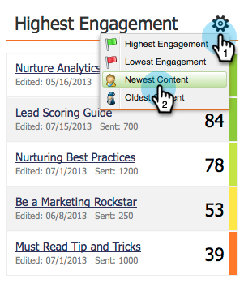

# Pannello di coinvolgimento {#the-engagement-dashboard}

Il Pannello di coinvolgimento è il modo più semplice per vedere le prestazioni del contenuto nei [programmi di coinvolgimento](http://docs.marketo.com/display/docs/drip+nurturing).

>[!NOTE]
>
>Il punteggio di coinvolgimento è calcolato 72 ore dopo ogni cast. Ulteriori informazioni sul punteggio di coinvolgimento .

## Visualizza il pannello Partecipazione {#view-the-engagement-dashboard}

Selezionate il programma di coinvolgimento e fate clic su **Visualizza > Dashboard**.

>[!TIP]
>
>Per informazioni statistiche più dettagliate, consultare il [report sulle prestazioni del flusso di coinvolgimento](engagement-stream-performance-report.md).

## Comprendere il widget di esaurimento {#understand-the-exhaustion-widget}

Questo widget consente di anticipare quando i lead avranno esaurito tutto il contenuto. Il punteggio di esaurimento viene calcolato immediatamente dopo ogni cast. L’esempio seguente mostra che in 1 cast, 195 lead avranno esaurito tutto il contenuto.

>[!NOTE]
>
>Per visualizzare il grafico, è necessario accedere alla scheda Configurazione e assicurarsi che le notifiche di contenuto con esaurimento siano **On**. Se sono spenti, il grafico avrà un aspetto diverso.

>[!CAUTION]
>
>Le persone &quot;esauste&quot; non riceveranno alcuna comunicazione nel cast successivo.

## Comprendere il coinvolgimento nel tempo {#understand-the-engagement-over-time-widget}

Mostra il punteggio medio di coinvolgimento nel tempo e l&#39;impatto delle modifiche ai contenuti.

>[!NOTE]
>
>**Disponibilità**
>
>Questa funzione è disponibile come componente aggiuntivo per i clienti che utilizzano Esplora ciclo ricavi di Marketo. Contatta il tuo Customer Success Manager per ulteriori informazioni.

Per visualizzare un singolo contenuto invece di una media, fate clic sull’icona a forma di ingranaggio, quindi selezionate il contenuto.

## Comprendere il widget di coinvolgimento più alto {#understand-the-highest-engagement-widget}

Un elenco di tutti i contenuti, ordinati in base al punteggio di coinvolgimento più alto.

Per modificare l&#39;ordinamento, fare clic sull&#39;icona a forma di ingranaggio, quindi selezionare l&#39;ordinamento.

*Edicola* e  ** Oldefissare sulla base del tempo dell&#39;ultima approvazione.

>[!NOTE]
>
>**Tubo profondo**
>
>Per saperne di più, consulta la sezione [Creazione di un programma di coinvolgimento](../../../../product-docs/email-marketing/drip-nurturing/creating-an-engagement-program/create-an-engagement-program.md).

