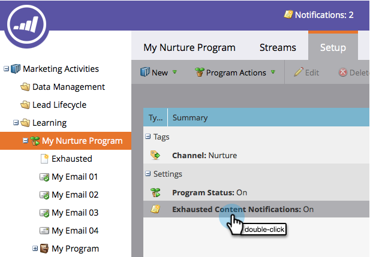

# Disattivare e abilitare le notifiche dei contenuti esauriti {#disable-and-enable-exhausted-content-notifications}

Quando le persone esauriscono tutti i contenuti di un flusso, Marketo può inviare una notifica. Puoi disabilitare/abilitare le notifiche in base alle tue esigenze. Ecco come.

1. Vai a **Attività di marketing**.

   

1. Seleziona un programma di coinvolgimento e fai clic sul pulsante **Configurazione** scheda .

   

1. Fare doppio clic **Notifiche di contenuto esaurite**.

   

1. Seleziona **Disattivato** o **On**) e fai clic su **Salva**.

   

   Super! Se abiliti le notifiche, vedrai qualcosa sul flusso stesso e riceverai una notifica e-mail.
