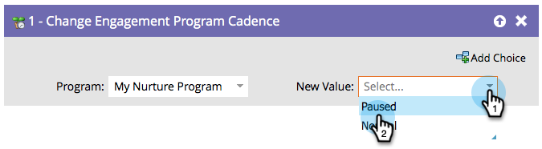

# Mettere in pausa le persone in un programma di coinvolgimento {#pause-people-in-an-engagement-program}

Quando una persona fa parte di un programma di coinvolgimento, riceverà il contenuto fino a quando non avrà [esaurito tutto il contenuto](people-who-have-exhausted-content.md). È possibile utilizzare il passaggio di flusso [[!UICONTROL Change Engagement Program Cadence]](/help/marketo/product-docs/core-marketo-concepts/smart-campaigns/program-flow-actions/change-engagement-program-cadence.md) per impedire alle persone di ricevere contenuto anche se non hanno ancora esaurito il contenuto.

1. Seleziona il programma di coinvolgimento.

   

1. Seleziona **[!UICONTROL Paused]** come **[!UICONTROL New Value]** per impedire alla persona di ricevere il contenuto.

   

   È possibile impostare di nuovo la persona su **[!UICONTROL Normal]** se si desidera che riceva nuovamente il contenuto. Riprenderanno da dove hanno interrotto.

   >[!NOTE]
   >
   >Se una persona viene messa in pausa, non potrà ricevere contenuti, ma continuerà a passare da un flusso all’altro se soddisfa i criteri.
