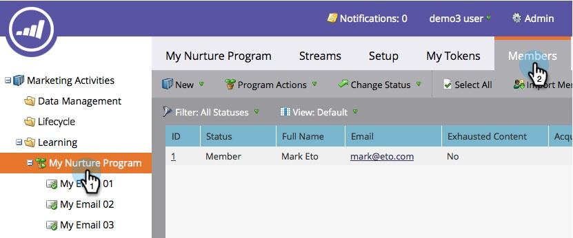

# Persone Con Contenuti Esauriti {#people-who-have-exhausted-content}

Quando una persona ha ricevuto ogni elemento di contenuto in un flusso, ha esaurito tutte le possibilità e rimarrà inattiva fino a quando non ne verranno aggiunti altri. Puoi trovare persone &quot;esauste&quot; in diversi modi.

## Filtro Membro del programma di coinvolgimento {#member-of-engagement-program-filter}

1. Crea un nuovo elenco avanzato, quindi individua e trascina nella **Membro del programma di coinvolgimento** filtro.

   

1. Trova e seleziona il programma di coinvolgimento in cui trovare le persone esauste.

   

1. Sotto **Aggiungi vincolo**, seleziona **Contenuto esaurito**.

   

1. Imposta **Contenuto esaurito** a **true**.

   

   È sufficiente eseguire questo elenco avanzato per visualizzare l’elenco delle persone che hanno esaurito tutto il contenuto del flusso in cui si trovano.

## Scheda Membri {#members-tab}

1. Vai a **Attività di marketing**.

   

1. Seleziona il programma di coinvolgimento e vai al **Membri** scheda.

   

1. Osserva la colonna denominata **Contenuto esaurito**.

   

   Questo mostra le persone che hanno esaurito tutto il contenuto e coloro che non lo hanno fatto.

## Flusso {#stream}

1. Puoi anche vedere il totale delle persone che hanno esaurito i contenuti nella scheda Streams sul flusso stesso.

   

   >[!NOTE]
   >
   >Questo numero viene aggiornato immediatamente dopo ogni cast.
