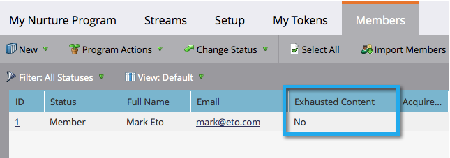

# Persone con contenuti esauriti {#people-who-have-exhausted-content}

Quando una persona ha ricevuto ogni elemento di contenuto in un flusso, ha esaurito tutte le possibilità e rimarrà inattiva fino a quando non ne verranno aggiunti altri. Puoi trovare persone &quot;esauste&quot; in diversi modi.

## Filtro Membro del programma di coinvolgimento {#member-of-engagement-program-filter}

1. Creare un nuovo elenco avanzato, quindi individuare e trascinare il filtro **[!UICONTROL Member of Engagement Program]**.

   

1. Trova e seleziona il programma di coinvolgimento in cui trovare le persone esauste.

   

1. In **[!UICONTROL Add Constraint]**, selezionare **[!UICONTROL Exhausted Content]**.

   

1. Imposta **[!UICONTROL Exhausted Content]** su **[!UICONTROL true]**.

   

   È sufficiente eseguire questo elenco avanzato per visualizzare l’elenco delle persone che hanno esaurito tutto il contenuto del flusso in cui si trovano.

## Scheda Membri {#members-tab}

1. Passa a **[!UICONTROL Marketing Activities]**.

   

1. Selezionare il programma di coinvolgimento e passare alla scheda **[!UICONTROL Members]**.

   

1. Si noti la colonna denominata **[!UICONTROL Exhausted Content]**.

   

   Questo mostra le persone che hanno esaurito tutto il contenuto e coloro che non lo hanno fatto.

## Flusso {#stream}

1. È inoltre possibile visualizzare il numero totale di persone che hanno esaurito il contenuto nella scheda [!UICONTROL Streams] del flusso stesso.

   

   >[!NOTE]
   >
   >Questo numero viene aggiornato immediatamente dopo ogni cast.
