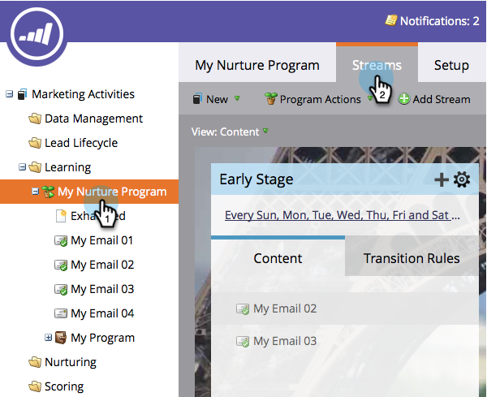

# Archiviazione e annullamento dell&#39;archiviazione dei contenuti in streaming {#archive-and-unarchive-stream-content}

Se non desideri più utilizzare una parte di contenuto in un flusso, puoi: [rimuovere](/help/marketo/product-docs/email-marketing/drip-nurturing/using-stream-content/remove-stream-content.md) o archiviarlo. Ecco come archiviare i contenuti.

>[!TIP]
>
>La rimozione elimina tutta la cronologia associata, mentre l&#39;archiviazione la conserva.

## Archivia contenuto flusso {#archive-stream-content}

1. Seleziona il programma di coinvolgimento e vai al **Flussi** scheda.

   

1. Passa il puntatore del mouse sull’e-mail che desideri archiviare, quindi fai clic su sotto l’icona a forma di ingranaggio **Archivia**.

   

   Tutto qui! Ricorda, archivia se desideri preservare la cronologia.

## Annulla archiviazione contenuto flusso {#unarchive-stream-content}

1. Seleziona il programma di coinvolgimento e vai al **Flussi** scheda.

   

1. Fai clic sull’icona a forma di ingranaggio del flusso, quindi fai clic su **Mostra contenuto archiviato**.

   

1. Ora che puoi visualizzare il contenuto archiviato, fai clic sull’icona a forma di ingranaggio del contenuto da annullare l’archiviazione, quindi fai clic su **Annulla archiviazione**.

   

   Perfetto! Ora questo contenuto è disponibile per essere prioritario e attivato.
