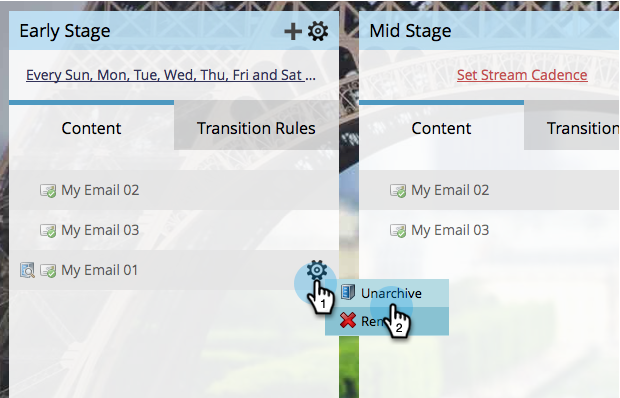

# Archiviare e annullare l’archiviazione dei contenuti in streaming {#archive-and-unarchive-stream-content}

Se non desideri più utilizzare un contenuto in un flusso, puoi [remove](/help/marketo/product-docs/email-marketing/drip-nurturing/using-stream-content/remove-stream-content.md) o archiviarlo. Ecco come archiviare i contenuti.

>[!TIP]
>
>La rimozione distrugge tutta la storia associata; l&#39;archiviazione la conserva.

## Archivia contenuto in streaming {#archive-stream-content}

1. Seleziona il tuo programma di coinvolgimento e vai al **Flussi** scheda .

   

1. Passa il puntatore del mouse sull’e-mail da archiviare, quindi fai clic su sotto l’icona a forma di ingranaggio **Archivia**.

   

   Tutto qui! Ricorda, archivia se vuoi preservare la storia.

## Annulla archiviazione contenuto flusso {#unarchive-stream-content}

1. Seleziona il tuo programma di coinvolgimento e vai al **Flussi** scheda .

   

1. Fai clic sull’icona a forma di ingranaggio per il flusso, quindi fai clic su **Mostra contenuto archiviato**.

   

1. Ora che puoi visualizzare il contenuto archiviato, fai clic sull’icona a forma di ingranaggio per il contenuto da rimuovere dall’archivio, quindi fai clic su **Annulla archiviazione**.

   

   Perfetto! Ora questo contenuto è disponibile per essere prioritario e attivato.
