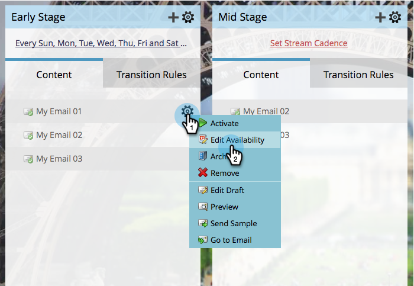

# Modifica disponibilità del contenuto di flusso {#edit-availability-of-stream-content}

Puoi impostare un intervallo di tempo per il contenuto affinché sia attivo nel flusso. Ecco come.

1. Seleziona il programma di coinvolgimento e vai al **Flussi** scheda.

   

1. Fai clic sull’icona a forma di ingranaggio del contenuto da pianificare, quindi seleziona **Modifica disponibilità**.

   

1. Seleziona il **Attivo da** data, quindi **Attivo tramite** data e clic **Salva**.

   

   >[!TIP]
   >
   >Puoi partire **Attivo tramite** vuoto per rendere il contenuto disponibile per sempre.

   Perfetto! Accanto al contenuto pianificato viene visualizzata l’icona dell’orologio. Diventerà attivo e inattivo in base alla pianificazione impostata.

   
