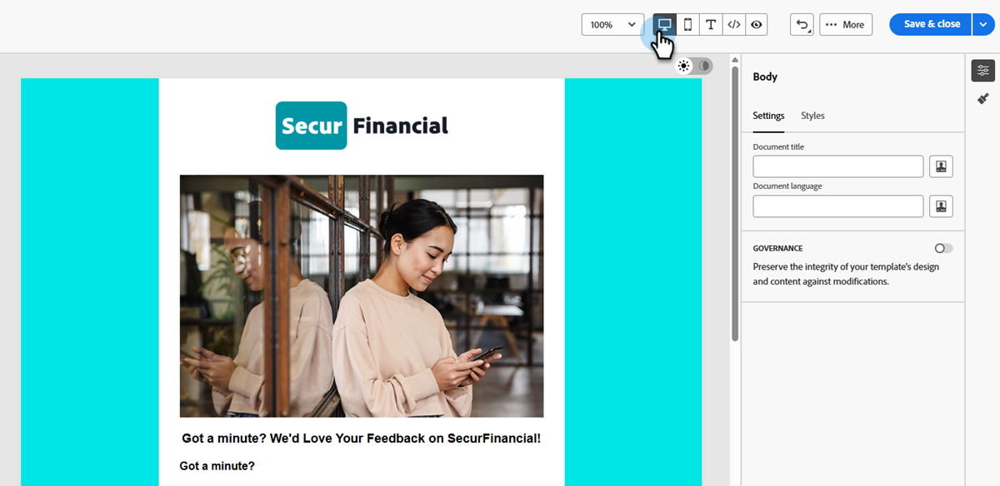

# Modificare i modelli e-mail con l’editor HTML avanzato {#advanced-html-mode}

La modalità avanzata di HTML consente di visualizzare e modificare il codice sorgente non elaborato dei modelli e-mail direttamente dall&#39;interfaccia di Designer e-mail [!DNL Marketo Engage].

Questa funzionalità consente di inserire espressioni avanzate direttamente nell’origine. Quando si torna alla visualizzazione visiva (desktop), il contenuto viene nuovamente sottoposto a rendering in modo da poter verificare l&#39;aspetto e continuare a modificare in entrambe le visualizzazioni.

## Guardrail {#guardrails}

Quando utilizzi l’editor HTML avanzato, i seguenti guardrail proteggono la compatibilità dei contenuti e impostano le aspettative.

* L&#39;editor HTML avanzato **non convalida** il codice. Non controlla gli errori di sintassi o i layout interrotti. Rivedi attentamente i contenuti prima di salvarli.

* I futuri aggiornamenti del sistema potrebbero sovrascrivere le modifiche apportate al markup predefinito. **È possibile che le modifiche non persistano**.

* [!DNL Adobe] supporto **impossibile risolvere o risolvere i problemi** causati da codice personalizzato e modifiche manuali. Conserva un backup del contenuto nel caso sia necessario ripristinarlo.

* Non è possibile simulare contenuti nella vista HTML avanzata. Passa alla vista Desktop per visualizzare in anteprima il contenuto.

* Per garantire la compatibilità del contenuto, **non è possibile salvare** nella visualizzazione avanzata di HTML. Tornare alla vista Desktop quando si è pronti a salvare le modifiche.

## Accedere alla modalità avanzata di HTML {#access-html-mode}

Per aprire l’editor di HTML avanzato e modificare l’origine del modello, segui la procedura riportata di seguito.

1. Aprire o [creare un modello di e-mail](/help/marketo/product-docs/email-marketing/email-designer/email-template-authoring.md#create-an-email-template) in E-mail Designer.

1. Nella schermata _Modifica modello e-mail_, fai clic sul pulsante HTML nell&#39;angolo in alto a destra.

   {width="800" zoomable="yes"}

1. La prima volta che apri l’editor di HTML avanzato, viene visualizzato un messaggio di avviso. Al termine, rivedi il clic **[!UICONTROL OK]**.

   

   >[!NOTE]
   >
   >Questo avviso viene visualizzato la prima volta che apri l’editor HTML avanzato e viene ripristinato ogni mese.

1. Viene visualizzato l’editor HTML avanzato.

   {width="800" zoomable="yes"}

1. Aggiungi le modifiche desiderate al contenuto dell’e-mail.

   >[!WARNING]
   >
   >Assicurati di immettere il codice HTML e CSS corretto in quanto non esiste un processo di convalida della sintassi e il supporto Adobe non è in grado di fornire assistenza per le modifiche apportate a HTML.

1. La simulazione e il salvataggio dei contenuti non sono disponibili nella visualizzazione HTML avanzata per motivi di compatibilità. Torna alla vista Desktop per visualizzare in anteprima il contenuto e salvare le modifiche.

   {width="800" zoomable="yes"}

   >[!NOTE]
   >
   >Le modifiche apportate vengono mantenute quando si passa da una visualizzazione all&#39;altra.
