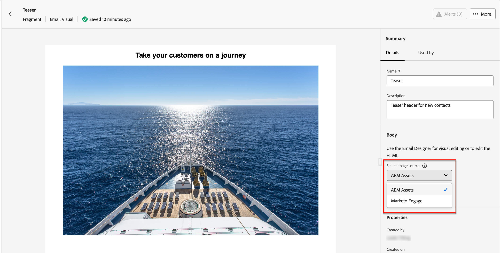

# Utilizzare risorse Experience Manager {#work-with-experience-manager-assets}

Quando _Adobe Experience Manager Assets as a Cloud Service_ è integrato con Adobe Marketo Engage, puoi accedere facilmente alle risorse digitali da utilizzare nei contenuti di marketing.

>[!PREREQUISITES]
>
>Collegare il documento MKTO/AEM.

>[!NOTE]
>
>Al momento, solo le risorse immagine di _Adobe Experience Manager Assets_ sono supportate nel Marketo Engage. Le modifiche alle risorse devono essere effettuate dall’archivio centrale di Adobe Experience Manager Assets. [Ulteriori informazioni](https://experienceleague.adobe.com/en/docs/experience-manager-cloud-service/content/assets/manage/manage-digital-assets)

Quando si utilizzano queste risorse digitali, le modifiche più recenti in _Assets as a Cloud Service_ si propagano automaticamente alle campagne e-mail live tramite riferimenti collegati. Se le immagini vengono eliminate in _Adobe Experience Manager Assets as a Cloud Service_, le immagini vengono visualizzate con un riferimento interrotto nelle e-mail. Quando le risorse attualmente utilizzate nel Marketo Engage vengono modificate o eliminate, gli autori delle e-mail vengono informati delle modifiche apportate all’immagine. Tutte le modifiche apportate alle risorse devono essere effettuate nell’archivio centrale di Adobe Experience Manager Assets.

## Utilizza AEM Assets come origine dell’immagine {#use-aem-assets-as-the-image-source}

Se l’ambiente dispone di una o più connessioni all’archivio delle risorse, puoi designare AEM Assets come origine per le risorse quando crei o visualizzi i dettagli di un’e-mail, un modello e-mail o un frammento visivo.

* Durante la creazione di un nuovo contenuto, scegli `AEM Assets` come elemento **[!UICONTROL Image Source]** nella finestra di dialogo.

{width="400"}

* Quando apri una risorsa di contenuto esistente, scegli `AEM Assets` nella sezione _[!UICONTROL Corpo]_ a destra.

{width="700" zoomable="yes"}

## Accedere alle risorse per la creazione {#access-assets-for-authoring}

>[!IMPORTANT]
>
>Un amministratore deve aggiungere gli utenti che hanno bisogno di accedere alle risorse ai profili di prodotto Utenti consumer di Assets e/o Utenti di Assets. [Ulteriori informazioni](https://experienceleague.adobe.com/en/docs/experience-manager-cloud-service/content/security/ims-support#managing-products-and-user-access-in-admin-console)

Nell&#39;editor di contenuti visivi, fai clic sull&#39;icona _Selettore risorse di Experience Manager_ nella barra laterale a sinistra. In questo modo il pannello strumenti diventa un elenco delle risorse disponibili nell’archivio selezionato.

{width="700" zoomable="yes"}

Se sono presenti più repository AEM connessi, fare clic sul pulsante **[!UICONTROL Gestisci come]** per scegliere il repository che si desidera utilizzare.

{width="700" zoomable="yes"}

Scegli l’archivio desiderato.

Esistono diversi metodi per aggiungere una risorsa immagine all’area di lavoro visiva:

* Trascina e rilascia la miniatura di un’immagine dal menu di navigazione a sinistra.

{width="700" zoomable="yes"}

* Aggiungi un componente immagine all&#39;area di lavoro e fai clic su **[!UICONTROL Sfoglia]** per aprire la finestra di dialogo _[!UICONTROL Seleziona Assets]_.

  Dalla finestra di dialogo, puoi scegliere un’immagine dall’archivio selezionato.

  Sono disponibili diversi strumenti per aiutarti a individuare la risorsa di cui hai bisogno.

{width="700" zoomable="yes"}

* Modifica l&#39;**[!UICONTROL Archivio]** in alto a destra.

* Fai clic su **[!UICONTROL Gestisci risorse]** in alto a destra per aprire l&#39;archivio Assets in un&#39;altra scheda del browser e utilizzare gli strumenti di gestione AEM Assets.

* Fai clic sul selettore _Tipo di visualizzazione_ in alto a destra per modificare la visualizzazione in **[!UICONTROL Vista a elenco]**, **[!UICONTROL Vista griglia]**, **[!UICONTROL Vista galleria]** o **[!UICONTROL Vista a cascata]**.

* Fai clic sull&#39;icona _Ordinamento_ per modificare l&#39;ordinamento tra crescente e decrescente.

* Fare clic sulla freccia del menu **[!UICONTROL Ordina per]** per modificare i criteri di ordinamento in **[!UICONTROL Nome]**, **[!UICONTROL Dimensione]** o **[!UICONTROL Modificato]**.

* Fai clic sull&#39;icona _Filtro_ in alto a sinistra per filtrare gli elementi visualizzati in base ai criteri.

* Immetti il testo da cercare nel campo Ricerca per filtrare gli elementi visualizzati in modo che corrispondano al nome della risorsa.

{width="700" zoomable="yes"}
