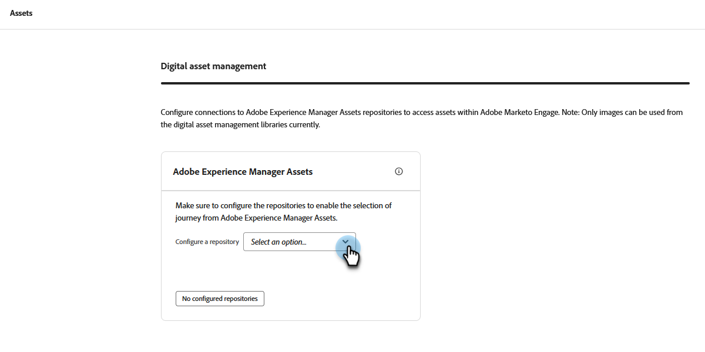

# Utilizzare le risorse di Experience Manager {#work-with-experience-manager-assets}

Connetti il tuo account _Adobe Experience Manager Assets as a Cloud Service_ all&#39;istanza Adobe Marketo Engage in modo da poter sfruttare l&#39;archivio AEM Asset in Marketo Engage Email Designer.

>[!NOTE]
>
>Al momento, in Marketo Engage sono supportate solo le risorse immagine di _Adobe Experience Manager Assets_. Le modifiche alle risorse devono essere effettuate dall’archivio centrale di Adobe Experience Manager Assets. [Ulteriori informazioni](https://experienceleague.adobe.com/en/docs/experience-manager-cloud-service/content/assets/manage/manage-digital-assets){target="_blank"}

## Collegamento ai servizi cloud di AEM {#link-to-your-aem-cloud-services}

Prima di poter utilizzare questa funzionalità, devi collegare i servizi cloud di AEM con Adobe Marketo Engage.

+++Collegare AEM Cloud Services e Marketo Engage

>[!NOTE]
>
>**Autorizzazioni amministratore richieste**

1. In Marketo Engage, vai all&#39;area **Amministratore** e seleziona **Adobe Experience Manager** nella struttura di navigazione a sinistra.

   {width="800" zoomable="yes"}

1. Fai clic su **Modifica** accanto a _Servizi cloud Adobe Experience Manager_.

   {width="400" zoomable="yes"}

1. Seleziona uno o più archivi.

   {width="800" zoomable="yes"}

   >[!NOTE]
   >
   >Sono elencati solo gli archivi associati alla stessa organizzazione IMS del tuo abbonamento a Marketo Engage.

1. Per configurare l&#39;archivio è necessario aggiungere un certificato di credenziali del servizio . Fare clic sul pulsante **+ Aggiungi certificato**.

   {width="800" zoomable="yes"}

1. Trascina e rilascia il certificato (solo file JSON) o selezionalo dal computer. Al termine, fai clic su **Aggiungi**.

   {width="600" zoomable="yes"}

1. L’archivio configurato viene visualizzato di seguito insieme a stato e scadenza. Fare clic sul pulsante con i puntini di sospensione (**...**) per visualizzare il certificato. Altrimenti, hai finito.

   {width="700" zoomable="yes"}

Ora tutte le immagini della libreria di gestione delle risorse digitali nell’archivio sono accessibili da Marketo Engage E-mail Designer.

+++

## Utilizzo delle risorse di AEM {#working-with-aem-assets}

Quando si utilizzano queste risorse digitali, le modifiche più recenti in _Assets as a Cloud Service_ si propagano automaticamente alle campagne e-mail live tramite riferimenti collegati. Se le immagini vengono eliminate in _Adobe Experience Manager Assets as a Cloud Service_, le immagini vengono visualizzate con un riferimento interrotto nelle e-mail. Quando le risorse attualmente utilizzate in Marketo Engage vengono modificate o eliminate, gli autori delle e-mail vengono informati delle modifiche apportate all’immagine. Tutte le modifiche apportate alle risorse devono essere effettuate nell’archivio centrale di Adobe Experience Manager Assets.

### Utilizza AEM Assets come origine dell’immagine {#use-aem-assets-as-the-image-source}

Se l’ambiente dispone di una o più connessioni all’archivio delle risorse, puoi designare AEM Assets come origine per le risorse quando crei o visualizzi i dettagli di un’e-mail, un modello e-mail o un frammento visivo.

* Durante la creazione di un nuovo contenuto, scegliere `AEM Assets` come elemento **[!UICONTROL Image Source]** nella finestra di dialogo.

{width="400" zoomable="yes"}

* Quando apri una risorsa di contenuto esistente, scegli `AEM Assets` nella sezione _[!UICONTROL Body]_a destra.

{width="700" zoomable="yes"}

### Accedere alle risorse per la creazione {#access-assets-for-authoring}

>[!IMPORTANT]
>
>Un amministratore deve aggiungere gli utenti che hanno bisogno di accedere alle risorse ai profili di prodotto Utenti consumer di Assets e/o Utenti di Assets. [Ulteriori informazioni](https://experienceleague.adobe.com/en/docs/experience-manager-cloud-service/content/security/ims-support#managing-products-and-user-access-in-admin-console)

Nell&#39;editor di contenuti visivi, fai clic sull&#39;icona _Selettore risorse Experience Manager_ nella barra laterale a sinistra. In questo modo il pannello strumenti diventa un elenco delle risorse disponibili nell’archivio selezionato.

{width="700" zoomable="yes"}

Se sono presenti più repository AEM connessi, fare clic sul pulsante **[!UICONTROL Manage as]** per scegliere il repository che si desidera utilizzare.

{width="700" zoomable="yes"}

Scegli l’archivio desiderato.

{width="500" zoomable="yes"}

Esistono diversi metodi per aggiungere una risorsa immagine all’area di lavoro visiva:

* Trascina e rilascia la miniatura di un’immagine dal menu di navigazione a sinistra.

{width="700" zoomable="yes"}

* Aggiungere un componente immagine all&#39;area di lavoro e fare clic su **[!UICONTROL Browse]** per aprire la finestra di dialogo _[!UICONTROL Select Assets]_.

  Dalla finestra di dialogo, puoi scegliere un’immagine dall’archivio selezionato.

  Sono disponibili diversi strumenti per aiutarti a individuare la risorsa di cui hai bisogno.

{width="700" zoomable="yes"}

* Modifica **[!UICONTROL Repository]** in alto a destra.

* Fai clic su **[!UICONTROL Manage assets]** in alto a destra per aprire l&#39;archivio Assets in un&#39;altra scheda del browser e utilizzare gli strumenti di gestione AEM Assets.

* Fai clic sul selettore _Tipo di visualizzazione_ in alto a destra per modificare la visualizzazione in **[!UICONTROL List View]**, **[!UICONTROL Grid View]**, **[!UICONTROL Gallery View]** o **[!UICONTROL Waterfall View]**.

* Fai clic sull&#39;icona _Ordinamento_ per modificare l&#39;ordinamento tra crescente e decrescente.

* Fare clic sulla freccia del menu **[!UICONTROL Sort by]** per modificare i criteri di ordinamento in **[!UICONTROL Name]**, **[!UICONTROL Size]** o **[!UICONTROL Modified]**.

* Fai clic sull&#39;icona _Filtro_ in alto a sinistra per filtrare gli elementi visualizzati in base ai criteri.

* Immetti il testo da cercare nel campo Ricerca per filtrare gli elementi visualizzati in modo che corrispondano al nome della risorsa.

{width="700" zoomable="yes"}
