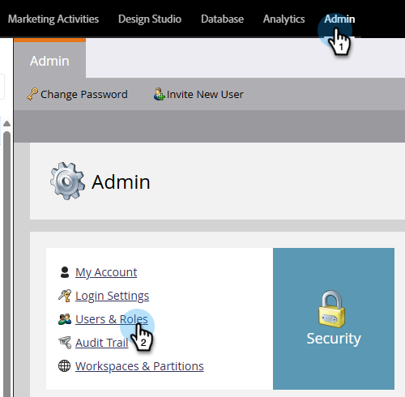
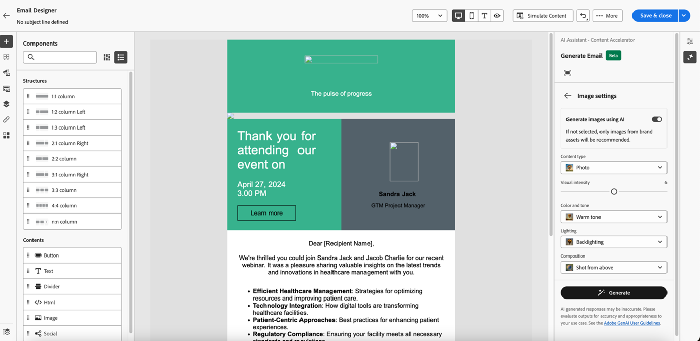

# Utilizzo dell’Assistente IA {#use-ai-assistant}

L’Assistente AI in Marketo Engage Email Designer consente di creare e-mail contemporanee, performanti e intuitive. Questo si ottiene tramite la tecnologia di IA generativa e la libreria di prompt di Adobe insieme a Firefly per la generazione di immagini, che aiutano a creare contenuti adatti per un particolare utente/gruppo acquisti, una fase del percorso di marketing, una strategia di comunicazione, il tono, ecc. Per creare contenuti è inoltre possibile utilizzare risorse specifiche per il brand.

>[!PREREQUISITES]
>
>L&#39;Assistente AI non è attivato per impostazione predefinita. Devi innanzitutto accettare i [Termini Gen-AI di base e i termini supplementari](https://www.adobe.com/legal/terms/enterprise-licensing/genai-ww.html){target="_blank"} per l&#39;utilizzo della funzionalità Gen-AI in E-mail Designer. Per informazioni, contatta il team dell’account di Adobe (il tuo account manager).

## Configurare le autorizzazioni {#set-up-permissions}

_Dopo_ che segue il prerequisito precedente, gli amministratori di Marketo devono applicare l&#39;accesso a utenti/ruoli specifici prima che gli utenti visualizzino i pulsanti GenAI.

1. In Marketo Engage, fai clic su **Amministratore** e seleziona **Utenti e ruoli**.

   

1. Nella scheda **Ruoli** fare doppio clic sul ruolo desiderato.

   

1. In _Access Design Studio_, selezionare la casella di controllo **Access AI Assistant** e fare clic su **Salva**.

   

1. Fai clic sulla scheda Utenti e seleziona l’utente a cui desideri fornire l’accesso.

   

1. Seleziona il ruolo scelto nel passaggio 3 e l’area di lavoro desiderata (se applicabile). Fai clic su **Salva**.

   

## Casi d’uso {#use-cases}

Esistono tre casi d’uso principali per l’Assistente IA:

* [Crea un oggetto](#create-a-subject-line) per l&#39;e-mail
* [Crea contenuto per una sezione specifica](#create-content-for-a-specific-section) dell&#39;e-mail
* [Crea un&#39;intera e-mail](#create-an-entire-email) da un modello selezionato

## Creare un oggetto {#create-a-subject-line}

Quando viene creato un messaggio e-mail utilizzando il nuovo Designer e-mail, immetti un oggetto temporaneo.

Dopo la creazione dell&#39;e-mail, l&#39;oggetto si trova nella colonna _Dettagli_ a destra. Fai clic sul pulsante Assistente IA (  ) accanto a esso per ottenere assistenza nella creazione di una nuova riga dell&#39;oggetto utilizzando la funzionalità di intelligenza artificiale generica.

Abilita l&#39;opzione **Usa contenuto di riferimento** per l&#39;Assistente AI per personalizzare nuovi contenuti in base al contenuto selezionato.

Immettere il prompt per personalizzare l&#39;oggetto. Inserisci le impostazioni di testo pertinenti e carica tutte le risorse del brand da utilizzare come riferimento per creare una riga dell’oggetto appropriata.

Le impostazioni di testo includono:

<table><tbody>
  <tr>
    <td style="width:25%"><b>Gruppo di acquisto</b></td>
    <td>Gruppo di acquisto specifico di destinazione (ad esempio, professionista, influenzatore, decision maker).</td>
  </tr>
  <tr>
    <td style="width:25%"><b>Fase Percorso marketing</b></td>
    <td>Destinatari in una particolare fase del percorso di marketing (ad esempio, Discover, Evaluate, Commit).</td>
  </tr>
  <tr>
    <td style="width:25%"><b>Strategia di comunicazione</b></td>
    <td>Obiettivo della comunicazione (ad esempio Urgente, A prova sociale, INFORMATIVO).</td>
  </tr>
  <tr>
    <td style="width:25%"><b>Lingua</b></td>
    <td>Lingua in cui desideri generare la riga dell’oggetto.</td>
  </tr>
  <tr>
    <td style="width:25%"><b>Tono</b></td>
    <td>Tono in cui desideri generare il contenuto (ad es. Inspirazionale, Eccitante, Umoristico).</td>
  </tr>
  <tr>
    <td style="width:25%"><b>Emoji</b></td>
    <td>Consente di includere le emoticon nel contenuto generato.</td>
  </tr>
</tbody>
</table>

Facendo clic su **Genera**, vengono visualizzati alcuni esempi tra cui scegliere:

Puoi anche caricare una risorsa del marchio per utilizzare il contenuto all’interno della risorsa come riferimento per creare la riga oggetto.

Per scegliere una variante, selezionarne la casella di controllo e fare clic su **Seleziona**. È inoltre possibile modificarlo facendo clic su **Perfeziona**. Inoltre, puoi fornire un feedback facendo clic sull&#39;icona miniature in alto o miniature in basso in modo che la tecnologia Gen-AI apprenda le tue preferenze.

Dopo aver effettuato la selezione, la riga dell’oggetto viene inserita nei Dettagli e-mail.

## Creare contenuti per una sezione specifica dell’e-mail {#create-content-for-a-specific-section}

Dopo aver creato l’e-mail, puoi modificare alcune sezioni, immagini o testo.

In questo esempio, utilizziamo un modello di assistenza sanitaria. Se l’immagine esistente dell’esperto sanitario non soddisfa le tue esigenze, puoi istruire l’assistente di intelligenza artificiale a creare la propria immagine di un esperto sanitario. Seleziona semplicemente il contenuto dell’immagine e fai clic su Assistente AI.

Immetti i dettagli pertinenti nel prompt, ad esempio, &quot;genera un’immagine per un esperto sanitario&quot; e aggiungi eventuali personalizzazioni desiderate. È inoltre possibile utilizzare la libreria dei prompt (a destra del prompt) se non si è sicuri di cosa immettere.

Dopo aver fatto clic su **Genera**, vengono create più varianti tra cui scegliere.

Simile all’immagine, è possibile modificare anche parti di testo dell’e-mail.

## Creare un messaggio e-mail completo da un modello selezionato {#create-an-entire-email}

Questa opzione è disponibile solo se l’e-mail viene creata utilizzando un modello esistente. Può essere un modello standard fornito da E-mail Designer, un modello salvato già creato o un modello importato utilizzando l’opzione Importa HTML. Questa opzione non è disponibile se per l&#39;e-mail si sceglie [Progetta da zero](/help/marketo/product-docs/email-marketing/email-designer/email-authoring.md#design-from-scratch).

Seleziona un modello, senza selezionare alcun componente all’interno del modello, quindi fai clic sul pulsante Assistente IA in E-mail Designer.

Immetti il prompt corrispondente e scegli le impostazioni di testo, le risorse del brand e le impostazioni immagine desiderate per l’e-mail.

Se desideri generare immagini con Firefly, seleziona Impostazioni immagine e seleziona l&#39;opzione per **Generare immagini con AI**.

Seleziona il _Tipo di contenuto_, _Colore e tono_, _Illuminazione_ e _Composizione_ per creare immagini Gen-AI per la tua e-mail. Al termine, fai clic su **Genera**.

Per vedere come si presenterà una variante nell&#39;e-mail, fai clic su **Anteprima**. Scegliere una variante facendo clic su **Applica**.
