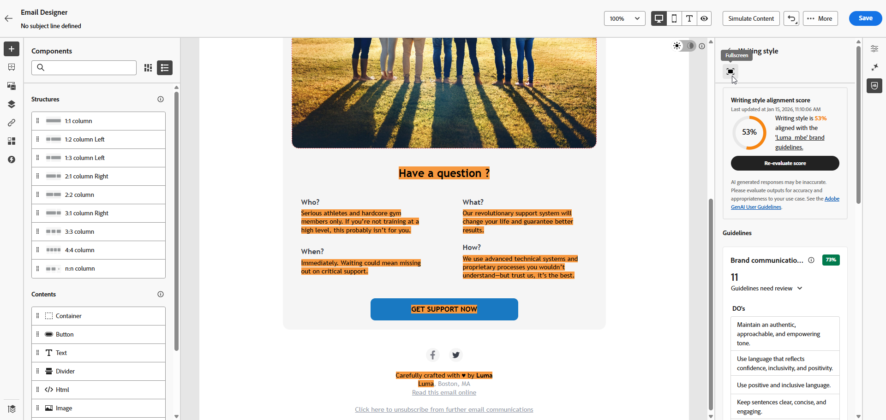

# Punteggio marchio {#brand-score}

La revisione del punteggio del tuo marchio garantisce coerenza in termini di tono, messaggi e identità visiva in tutte le campagne e-mail e funge da controllo di qualità prima che il contenuto venga reso disponibile.

>[!AVAILABILITY]
>
>Prima di poter utilizzare l&#39;Assistente di intelligenza artificiale in Adobe Marketo Engage, devi accettare il [contratto utente](https://www.adobe.com/legal/licenses-terms/adobe-dx-gen-ai-user-guidelines.html){target="_blank"}{target="_blank"}. Per ulteriori informazioni, contatta il tuo rappresentante Adobe.

## Convalidare i contenuti con l’allineamento del brand {#validate-content}

Dopo aver [configurato e pubblicato](/help/marketo/product-docs/email-marketing/email-designer/brands/manage-brands.md#create-brand-kit){target="_blank"} il tuo marchio, valuta il tuo punteggio di allineamento del brand direttamente nella tua campagna e-mail per garantire che il contenuto sia allineato alle linee guida del brand.

1. Nell&#39;e-mail, fai clic sull&#39;icona **[!UICONTROL Brand Alignment]**.

   Il contenuto valuta automaticamente il [marchio predefinito](/help/marketo/product-docs/email-marketing/email-designer/brands/manage-brands.md#default-brand){target="_blank"}.

   {width="800" zoomable="yes"}

1. Per valutare l&#39;utilizzo di un marchio diverso, selezionarlo dal menu a discesa **[!UICONTROL Brand]** e fare clic su **[!UICONTROL Evaluate score]**.

   {width="800" zoomable="yes"}

1. Sfoglia **[!UICONTROL Writing style]** o **[!UICONTROL Visual content]** per visualizzare ulteriori informazioni sul tuo punteggio.

   {width="800" zoomable="yes"}

1. Fai clic sull&#39;icona  per una visualizzazione dettagliata del punteggio di qualità.

   {width="800" zoomable="yes"}

1. Seleziona una linea guida segnalata per visualizzare feedback e suggerimenti specifici. L’allineamento del brand valuta le seguenti categorie:

   * **[!UICONTROL Writing style]**:
      * **[!UICONTROL Brand communication style]**: definisce la personalità e il tono emotivo per garantire la coerenza della voce del brand su tutti i canali.
      * **[!UICONTROL Brand messaging standards]**: Regole strutturali e di formattazione per un efficace testo di marketing e promozionale.
      * **[!UICONTROL Legal compliance standards]**: garantisce che tutte le comunicazioni siano conformi ai requisiti legali, inclusi il posizionamento del testo e le liste di controllo di conformità.

   * **[!UICONTROL Visual content]**:
      * **[!UICONTROL Photography standards]**: requisiti per il contenuto fotografico, inclusi risoluzione, composizione, illuminazione e formati di file.
      * **[!UICONTROL Illustration standards]**: parametri di stile, spessore delle linee, utilizzo dei colori e requisiti di formato del file per le illustrazioni.
      * **[!UICONTROL Icon standards]**: specifiche per la progettazione delle icone, inclusi i sistemi griglia, lo spessore della traccia e il dimensionamento per l&#39;uniformità.
      * **[!UICONTROL Usage guidelines]**: best practice per la selezione, il posizionamento e il contesto delle immagini per mantenere l&#39;identità del brand.

   {width="800" zoomable="yes"}

1. Modifica i contenuti in base ai consigli per migliorare l’allineamento del brand.

1. Rivaluta manualmente il contenuto dopo aver apportato modifiche per aggiornare il punteggio di allineamento.

## Convalidare la qualità dei contenuti {#validate-quality}

>[!NOTE]
>
>La valutazione della qualità dei contenuti è indipendente dalle linee guida del brand. Anche se un brand è selezionato nel menu a discesa, le sue linee guida non vengono applicate al controllo di qualità. La selezione del brand è pertinente solo per il punteggio di allineamento del brand.

Oltre all’allineamento del brand, puoi valutare la qualità generale dei contenuti per identificare potenziali problemi di leggibilità, coerenza ed efficacia dei contenuti, indipendentemente dalle linee guida del brand.

Per valutare la qualità dei contenuti:

1. Nell&#39;e-mail, fai clic sull&#39;icona **[!UICONTROL Brand Alignment]**.

   {width="800" zoomable="yes"}

1. Fai clic su **[!UICONTROL Evaluate score]** per generare sia l&#39;allineamento del brand che i punteggi di qualità del contenuto.

   {width="800" zoomable="yes"}

1. Passa alla scheda **[!UICONTROL Overall quality]** per rivedere approfondimenti sulla qualità dei contenuti e consigli.

   {width="800" zoomable="yes"}

1. Fai clic sull&#39;icona  per una visualizzazione dettagliata del punteggio di qualità.

   {width="800" zoomable="yes"}

1. Seleziona qualsiasi elemento contrassegnato per visualizzare feedback specifici e suggerimenti fruibili per il miglioramento. I punteggi si basano sulle seguenti categorie:

   * **[!UICONTROL CTA effectiveness]**: valuta se il call-to-action motiva i lettori a intraprendere l&#39;azione desiderata.
   * **[!UICONTROL Subject Line]**: valuta la chiarezza, la rilevanza e la qualità che attira l&#39;attenzione per incoraggiare l&#39;apertura delle e-mail.
   * **[!UICONTROL Readability]**: misura quanto è facile e coinvolgente il tuo contenuto per essere compreso dai lettori.
   * **[!UICONTROL Spam Check]**: identifica i trigger di posta indesiderata comuni che possono influire sul recapito messaggi.
   * **[!UICONTROL Content Cohesiveness]**: assicura un flusso ottimale dei contenuti e la permanenza sull&#39;argomento.
   * **[!UICONTROL Proofreading]**: verifica l&#39;ortografia, la grammatica e la chiarezza.

   {width="800" zoomable="yes"}

1. Modifica i contenuti in base ai consigli per migliorarne la leggibilità, la coerenza e la qualità complessiva.

1. Fai clic su **[!UICONTROL Re-evaluate score]** dopo aver apportato modifiche per aggiornare il punteggio di qualità.
