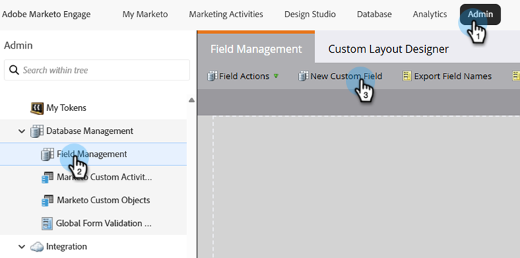

# Conformità alle linee guida CNIL: tracciamento dell’apertura condizionale delle e-mail {#cnil}

Scopri come configurare Marketo Engage per rispettare il consenso degli utenti finali per il tracciamento dell’apertura delle e-mail (pixel), in conformità alle linee guida CNIL (COMMUNITY LINK). L’approccio utilizza un campo booleano personalizzato per determinare quale variante e-mail riceve una persona, una con il tracciamento aperto abilitato o una con esso disabilitato.

## Passaggio 1: creare un campo booleano personalizzato {#custom-field}

1. Nell&#39;area **Amministratore**, fare clic su **Gestione campi** e selezionare **Nuovo campo personalizzato**.

   

1. Per _Oggetto_, scegli **Persona**. Per _Type_, scegli **Boolean**. Per _Name_, immetti &quot;Email Pixel Tracking&quot; (il nome API si popola automaticamente). Fai clic su **Crea**.

   

## Passaggio 2: compilare il campo del consenso {#populate}

1. Imposta il valore del campo EmailPixelTracking per ogni persona tramite l’importazione di dati (sincronizzazione API o caricamento CSV).

   

1. Assicurati che il campo personalizzato sia mappato correttamente.

   

>[!NOTE]
>
>In futuro, potrai acquisire i dati direttamente durante la compilazione di un modulo, consentendo all’utente di dare o rinunciare al tracciamento delle aperture dei messaggi e-mail.

## Passaggio 3: creare varianti e-mail {#variants}

Crea due e-mail. Il tracciamento dell’apertura delle e-mail è abilitato per impostazione predefinita sia per E-mail Designer che per l’editor e-mail legacy.

* **E-mail uno (tracciamento delle aperture abilitato)**: dopo la creazione dell&#39;e-mail, non è richiesta alcuna ulteriore azione. Mantieni il tracciamento aperto abilitato.

* **E-mail due (tracciamento delle aperture disabilitato)**: Clona e-mail uno e disabilita il tracciamento delle aperture.

  

In E-mail Designer, la casella di controllo **Disattiva tracciamento aperto** si trova nella scheda _Dettagli_ del riquadro _Riepilogo_ a destra dell&#39;e-mail. Nell&#39;editor e-mail legacy, la casella di controllo **Disattiva tracciamento aperto** è disponibile nel menu _Modifica impostazioni_.

**E-mail Designer**

{width="800" zoomable="yes"}

**Editor e-mail legacy**

{width="800" zoomable="yes"}

## Passaggio 4: configurare la campagna intelligente {#smart-campaign}

Crea una campagna avanzata per determinare quale e-mail riceve ogni persona.

1. Nella scheda _Flusso_ della tua Smart Campaign, inserisci il passaggio di flusso **Invia e-mail**.

   {width="800" zoomable="yes"}

1. Nel passaggio del flusso, fare clic su **Aggiungi scelta**. Nella scelta 1, imposta **if** su _EmailPixelTracking_, imposta l&#39;operatore su _is_ e imposta il valore su _false_. Per **E-mail**, seleziona _E-mail due_.

1. In Scelta predefinita, impostare **E-mail** su _E-mail uno_.

   

In questo modo le persone che non hanno acconsentito al tracciamento aperto ricevono l’e-mail non tracciata, mentre le persone che hanno acconsentito ricevono l’e-mail tracciata standard.
