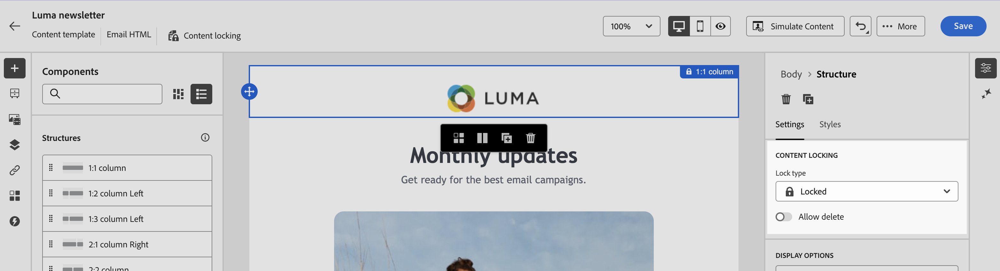

# Bloccare il contenuto nei modelli e-mail {#lock-content-email-templates}

Marketo Engage consente di bloccare il contenuto nei modelli e-mail, bloccando l’intero modello o strutture/componenti specifici. Questo consente di evitare modifiche o eliminazioni non intenzionali, garantendo un maggiore controllo sulla personalizzazione dei modelli e migliorando l’efficienza e l’affidabilità delle campagne e-mail.

>[!AVAILABILITY]
>
>Gli utenti autorizzati a creare modelli di contenuto possono abilitare il blocco del contenuto.

Il blocco del contenuto può essere applicato al livello **struttura** o al livello **componente**.

* Quando una struttura è bloccata:

   * Anche tutto il contenuto all’interno di tale struttura è bloccato.
   * Nessun contenuto può essere aggiunto alla struttura.
   * Per impostazione predefinita, non è possibile eliminare la struttura. È possibile ignorare questa restrizione abilitando l’opzione &quot;Consenti eliminazione&quot;.
   * I singoli componenti di contenuto all’interno della struttura bloccata possono essere impostati come modificabili.

* Quando una struttura è modificabile (struttura non bloccata):

   * I singoli componenti di contenuto possono essere bloccati all’interno di tale struttura.
   * Per impostazione predefinita, non è possibile eliminare un componente se è bloccato o se è selezionato &quot;Solo blocco di contenuto modificabile&quot;. È possibile ignorare questa restrizione abilitando l’opzione &quot;Consenti eliminazione&quot;.

## Bloccare un modello e-mail {#lock-an-email-template}

### Abilita blocco del contenuto {#enable-content-locking}

Puoi abilitare il blocco del contenuto per un modello e-mail direttamente in E-mail Designer, sia che tu stia creando un nuovo modello che ne stia modificando uno esistente.

1. Apri o crea un modello e-mail e accedi alla schermata di modifica del contenuto nel Designer e-mail.

1. Nel riquadro **[!UICONTROL Body]** a destra, abilitare l&#39;opzione **[!UICONTROL Governance]**.

1. Dall&#39;elenco a discesa **[!UICONTROL Mode]**, selezionare la modalità di blocco desiderata per il modello:

   * **[!UICONTROL Content locking]**: Blocca sezioni specifiche del contenuto all&#39;interno del modello. Per impostazione predefinita, tutte le strutture e i componenti diventano modificabili. Puoi quindi bloccare selettivamente singoli elementi.
   * **[!UICONTROL Read only]**: Blocca l&#39;intero contenuto del modello, impedendo eventuali modifiche.

   {width="800" zoomable="yes"}

1. Se hai selezionato la modalità **[!UICONTROL Content locking]**, puoi definire ulteriormente il modo in cui gli utenti possono interagire con il modello. Abilitare l&#39;opzione **[!UICONTROL Enable content edition]** e scegliere una delle opzioni seguenti:

   * **[!UICONTROL Allow structure & content addition]**: gli utenti possono aggiungere strutture tra quelle esistenti e aggiungere componenti di contenuto o frammenti all&#39;interno di strutture modificabili.

   * **[!UICONTROL Allow content addition only]**: gli utenti possono aggiungere componenti di contenuto o frammenti all&#39;interno di strutture modificabili, ma non possono aggiungere o duplicare strutture.

1. Dopo aver selezionato la modalità di blocco, è possibile definire le strutture e/o i componenti da bloccare se è stata selezionata la modalità **[!UICONTROL Content locking]**:

   * [Scopri come bloccare le strutture](#lock-structures)
   * [Scopri come bloccare i componenti](#lock-components)

   Se si sceglie la modalità **[!UICONTROL Read only]**, è possibile procedere con la finalizzazione e il salvataggio del modello.

È possibile modificare le impostazioni di **[!UICONTROL Governance]** in qualsiasi momento durante la progettazione del modello selezionando il corpo del modello. A tale scopo, fare clic sul collegamento **[!UICONTROL Body]** nella barra di navigazione nella parte superiore del riquadro a destra.

{width="800" zoomable="yes"}

### Bloccare le strutture {#lock-structures}

Per bloccare una struttura all’interno del modello:

1. Seleziona la struttura da bloccare.

1. Nell&#39;elenco a discesa **[!UICONTROL Lock type]**, scegliere **[!UICONTROL Locked]**.

   {width="800" zoomable="yes"}

   >[!NOTE]
   >
   >Per impostazione predefinita, gli utenti non possono eliminare le strutture bloccate. È possibile ignorare questa restrizione abilitando l&#39;opzione **[!UICONTROL Allow delete]**.

Dopo aver bloccato una struttura, non è più possibile duplicare o aggiungere altri componenti o frammenti di contenuto al suo interno. Anche tutti i componenti all’interno di una struttura bloccata vengono bloccati per impostazione predefinita. Per rendere modificabile un componente all’interno di una struttura bloccata:

1. Seleziona il componente da sbloccare.

1. Abilitare l&#39;opzione **[!UICONTROL Use specific locking]**.

1. Nell&#39;elenco a discesa **[!UICONTROL Lock type]**, scegliere **[!UICONTROL Editable]**. Per consentire la modifica del contenuto durante il blocco degli stili, selezionare **[!UICONTROL Editable content only]**. [Scopri come bloccare i componenti](#lock-components)

   {width="800" zoomable="yes"}

### Bloccare i componenti {#lock-components}

Per bloccare un componente specifico all’interno di una struttura:

1. Selezionare il componente e abilitare l&#39;opzione **[!UICONTROL Use specific locking]** nel riquadro di destra.

1. Dall&#39;elenco a discesa **[!UICONTROL Lock type]**, selezionare l&#39;opzione di blocco preferita:

   {width="800" zoomable="yes"}

   * **[!UICONTROL Editable content lock only]**: blocca gli stili del componente ma consente la modifica del contenuto.
   * **[!UICONTROL Locked]**: blocco completo del contenuto e degli stili del componente.

   >[!NOTE]
   >
   >Il tipo di blocco **[!UICONTROL Editable]** consente agli utenti di modificare un componente, anche all&#39;interno di una struttura bloccata. [Scopri come bloccare le strutture](#lock-structures)

1. Per impostazione predefinita, gli utenti non possono eliminare i componenti bloccati. È possibile abilitare l&#39;eliminazione attivando l&#39;opzione **[!UICONTROL Allow delete]**.

### Identificare il contenuto bloccato {#identify-locked-content}

Per identificare facilmente le strutture e i componenti bloccati all&#39;interno del modello, utilizzare **[!UICONTROL Navigation tree]** che si trova nel menu a sinistra. Questo menu fornisce una panoramica visiva di tutti gli elementi del modello, evidenziando gli elementi bloccati con un’icona a forma di lucchetto e gli elementi modificabili con un’icona a forma di matita.

Nell’esempio seguente, la governance è abilitata per il corpo del modello. *La struttura 2* è bloccata con *Il componente 1* è modificabile, mentre *La struttura 3* è completamente bloccata.

{width="800" zoomable="yes"}

## Utilizzare modelli con contenuti bloccati {#use-templates-with-locked-content}

Quando si utilizza un modello con contenuto bloccato, il messaggio **[!UICONTROL Governance enabled]** viene visualizzato nel riquadro di destra.

A seconda del tipo di blocco applicato al modello, è possibile eseguire azioni diverse sulle strutture e sui componenti del modello. Per identificare rapidamente tutte le aree modificabili nel modello, abilitare l&#39;opzione **[!UICONTROL Highlight editable areas]**.

Ad esempio, nel modello seguente, tutte le aree sono modificabili, ad eccezione dell’immagine superiore che è stata bloccata, il che significa che non è possibile modificarla o rimuoverla.

{width="800" zoomable="yes"}

Di seguito sono riportati alcuni esempi di modifica delle e-mail e della configurazione associata di blocco del contenuto configurata:

<table>
<thead>
  <tr>
    <th>Tipo di blocco del contenuto</th>
    <th>Configurazione del modello</th>
    <th>Edizione e-mail</th>
  </tr></thead>
<tbody>
  <tr>
    <td>Modello di contenuto di sola lettura</td>
    <td></td>
    <td></td>
  </tr>
  <tr>
    <td>Il contenuto completo è modificabile, ma gli utenti non possono aggiungere alcuna struttura o componente</td>
    <td></td>
    <td></td>
  </tr>
  <tr>
    <td>Struttura bloccata che non può essere eliminata</td>
    <td></td>
    <td></td>
  </tr>
  <tr>
    <td>Componente con stili bloccati che non può essere eliminato. Gli utenti possono solo modificare il contenuto.</td>
    <td></td>
    <td></td>
  </tr>
  <tr>
    <td>Componente modificabile in una struttura bloccata.</td>
    <td></td>
    <td></td>
  </tr>
</tbody>
</table>
