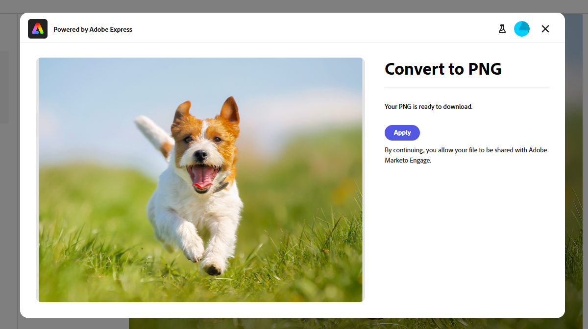

# Modificare le immagini con Adobe Express {#edit-images-with-adobe-express}

Adobe Marketo Engage si integra in modo nativo con Adobe Express e consente di accedere a una serie di strumenti di modifica delle immagini. Questi strumenti consentono di modificare le immagini in Marketo Engage Design Studio. L’integrazione offre i seguenti vantaggi chiave:

* È stato aumentato il riutilizzo dei contenuti modificando e salvando nuove immagini in Marketo Engage.

* Riduzione del tempo e dell&#39;impegno necessari per aggiornare le immagini o crearne di nuove.

>[!NOTE]
>
>Al momento, Adobe Express supporta solo i formati di file immagine PNG e JPEG.

## Accedere all’editor di Adobe Express {#access-the-adobe-express-editor}

Esistono due modi per accedere all’editor di Adobe Express.

>[!BEGINTABS]

>[!TAB Fare clic sul nome dell&#39;immagine]

1. In Marketo Engage, passare a **[!UICONTROL Design Studio]** e selezionare **[!UICONTROL Immagini e file]**.

   {width="600" zoomable="yes"}

1. Seleziona l’immagine da modificare.

   {width="600" zoomable="yes"}

   >[!NOTE]
   >
   >* Per visualizzare le risorse per area di lavoro e cartella, apri la struttura facendo clic sull&#39;icona **[!UICONTROL Mostra cartelle]** in alto a sinistra.
   >
   >* Per ordinare la tabella in base a una delle colonne, fare clic sul titolo della colonna. La freccia nella riga del titolo indica la colonna e l&#39;ordine di ordinamento correnti.

1. Nella scheda immagine _Dettagli_, fai clic su **[!UICONTROL Modifica in Adobe Express]**.

   {width="600" zoomable="yes"}

   >[!CAUTION]
   >
   >Se nell’e-mail o nel modello e-mail è già presente un riferimento all’immagine, eventuali modifiche apportate la aggiorneranno ovunque venga attualmente utilizzata.

>[!TAB Azioni immagine e file]

1. In Marketo Engage, passare a **[!UICONTROL Design Studio]** e selezionare **[!UICONTROL Immagini e file]**.

   {width="600" zoomable="yes"}

   >[!NOTE]
   >
   >* Per visualizzare le risorse per area di lavoro e cartella, apri la struttura facendo clic sull&#39;icona **[!UICONTROL Mostra cartelle]** in alto a sinistra.
   >
   >* Per ordinare la tabella in base a una delle colonne, fare clic sul titolo della colonna. La freccia nella riga del titolo indica la colonna e l&#39;ordine di ordinamento correnti.

1. Seleziona la casella di controllo accanto all’immagine da modificare. Nel menu a discesa **[!UICONTROL Azioni immagine e file]**, seleziona **[!UICONTROL Modifica in Adobe Express]**.

   {width="600" zoomable="yes"}

   >[!CAUTION]
   >
   >Se nell’e-mail o nel modello e-mail è già presente un riferimento all’immagine, eventuali modifiche apportate la aggiorneranno ovunque venga attualmente utilizzata.

>[!ENDTABS]

## Licenza Adobe Express Enterprise {#adobe-express-enterprise-license}

### Utenti con una licenza Enterprise {#users-with-an-enterprise-license}

Se disponi di una licenza Enterprise per Adobe Express, puoi accedere all’editor Express completo. È possibile regolare le impostazioni dell&#39;immagine come colore, luminosità, nitidezza, contrasto, dimensione e altro ancora. L’opzione AI Magic consente di rimuovere gli sfondi, inserire e rimuovere oggetti e cancellare parti di un’immagine.

>[!IMPORTANT]
>
>Per accedere a tutte le funzionalità di modifica di Adobe Express, la licenza acquistata deve trovarsi nella stessa organizzazione IMS del tuo abbonamento Marketo Engage. Inoltre, ogni singolo utente deve disporre di una licenza in Adobe Express. Gli utenti [senza una licenza](#users-without-an-enterprise-license) possono accedere solo alle azioni rapide in Adobe Express.

### Utenti senza una licenza Enterprise {#users-without-an-enterprise-license}

Per chi non dispone di una licenza Enterprise, è comunque possibile accedere a diverse funzioni di modifica rapida delle azioni. Tali caratteristiche sono:

* [Ridimensiona immagine](#resize-image)
* [Rimuovi sfondo](#remove-background)
* [Ritaglia immagine](#crop-image)
* [Converti in PNG/JPEG](#convert-to-png-jpeg)

Le funzioni sono accessibili sul lato sinistro della pagina immagine.

{width="800" zoomable="yes"}

#### Ridimensiona immagine {#resize-image}

1. Fare clic su **Ridimensiona immagine**.

1. Apporta le modifiche desiderate e al termine fai clic su **Applica**.

{width="800" zoomable="yes"}

<table><tbody>
  <tr>
    <td style="width:25%"><b>Proporzioni</b></td>
    <td>Nell'elenco a discesa <b>Proporzioni</b>, scegli <b>Standard</b> su BLANK oppure <b>Custom</b> per impostare la tua larghezza/altezza.</td>
  </tr>
  <tr>
    <td style="width:25%"><b>Larghezza e altezza</b></td>
    <td>Per impostazione predefinita, le proporzioni sono bloccate, mantenendo le stesse proporzioni dell'immagine quando ne regolate le dimensioni. Se necessario, è possibile selezionare il pulsante di blocco per sbloccare le proporzioni.</td>
  </tr>
  <tr>
    <td style="width:25%"><b>Ripristino</b></td>
    <td>Fare clic su <b>Reimposta</b> per rimuovere eventuali modifiche apportate all'immagine e riportarla allo stato originale.</td>
  </tr>
  <tr>
    <td style="width:25%"><b>Zoom e ritaglio</b></td>
    <td>Fai clic su <b>Zoom e ritaglio</b> per ingrandire aree specifiche dell'immagine. Facendo clic su <b>Applica</b> dopo lo zoom, l'immagine viene ritagliata in base al contenuto visualizzato.</td>
  </tr>
</tbody>
</table>

#### Rimuovi sfondo {#remove-background}

1. Fare clic su **Rimuovi sfondo**.

1. Adobe Express visualizza l’immagine senza sfondo. Se soddisfa le tue esigenze, fai clic su **Applica**.

{width="800" zoomable="yes"}

>[!TIP]
>
>Per ripristinare lo sfondo, selezionare l&#39;immagine e selezionare di nuovo **Rimuovi sfondo**.

#### Ritaglia immagine {#crop-image}

1. Fare clic su **[!UICONTROL Ritaglia immagine]**.

1. Trascinate gli angoli dell&#39;immagine per creare il ritaglio desiderato.

{width="800" zoomable="yes"}

1. Al termine, fai clic su **[!UICONTROL Applica]**.

#### Converti in PNG/JPEG {#convert-to-png-jpeg}

Convertire un file PNG in un file JPEG o un file JPEG in un file PNG.

1. Fare clic su **[!UICONTROL Converti in PNG/JPEG]**.

{width="800" zoomable="yes"}

1. Fare clic su **[!UICONTROL Applica]**.

—RITAGLIO SOTTO—

Fai clic su Ritaglia immagine nella pagina.

Nell’editor di Adobe Express, esegui il ritaglio dell’immagine e fai clic su Salva.

Nota: questa azione non sovrascrive l&#39;immagine, ma la presenta per ulteriori modifiche.

Puoi eseguire ulteriori aggiornamenti utilizzando un’altra opzione nel pannello di sinistra, fare clic su Salva per sovrascrivere l’immagine esistente o su Salva come nuova risorsa per salvarla come nuova immagine.

Fai clic su Salva per completare l’azione.

## Salvare i dati {#save-your-work}

Al termine delle modifiche, fai clic su Salva per salvare i dati.

SCHERMATA

L&#39;immagine modificata viene salvata nella stessa cartella dell&#39;immagine originale.
