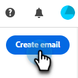
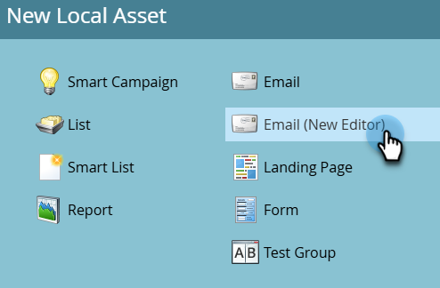
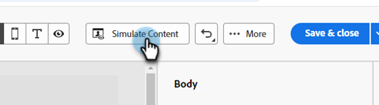

# Authoring di e-mail {#email-authoring}

Scopri come creare, personalizzare e visualizzare in anteprima le e-mail nel nuovo Marketo Engage Email Designer.

>[!PREREQUISITES]
>
>Per accedere al nuovo e-mail designer, la sottoscrizione a Marketo Engage deve essere migrata a [Adobe Identity Management System (IMS)](https://experienceleague.adobe.com/en/docs/marketo/using/product-docs/administration/marketo-with-adobe-identity/adobe-identity-management-overview). Se non lo hai ancora fatto e desideri richiederne la rapidità, contatta il team dell&#39;account Adobe (il tuo account manager) o il [supporto Marketo](https://nation.marketo.com/t5/support/ct-p/Support).

## Creare un messaggio e-mail {#create-an-email}

Le e-mail inviate da e-mail designer possono essere create solo in Design Studio e a cui si fa riferimento in Smart Campaigns/Lists, oppure create/utilizzate direttamente in Email Programs (Programmi e-mail) in questo momento.

>[!BEGINTABS]

>[!TAB Studio Progettazione]

1. Accedi a Marketo Engage tramite [Adobe Experience Cloud](https://experiencecloud.adobe.com/){target="_blank"}.

1. In Il mio Marketo, seleziona **Design Studio**.

   

1. Nella struttura, seleziona **E-mail (nuovo editor)**.

   

1. Fai clic sul pulsante **Crea e-mail**.

   

1. Immetti un nome e un oggetto per l’e-mail. Fai clic su **Crea**.

   

>[!TAB Programma e-mail]

1. Accedi a Marketo Engage tramite [Adobe Experience Cloud](https://experiencecloud.adobe.com/){target="_blank"}.

1. Trova e seleziona (o crea) il programma e-mail.

   

1. Sono disponibili due opzioni per creare una nuova e-mail. Fai clic con il pulsante destro del mouse sul nome del programma e-mail e seleziona **Nuova risorsa locale** oppure fai clic sul pulsante **+Nuova e-mail** nella casella E-mail nel dashboard. In questo esempio, eseguiremo la prima.

   

1. Seleziona **E-mail (nuovo editor)**.

   

1. Immetti un nome e un oggetto per l’e-mail. Fai clic su **Crea**.

   

>[!ENDTABS]

Tutto qui. Ora è il momento di progettare la tua e-mail.

## Scegli il tipo di contenuto {#choose-your-content-type}

1. Nell&#39;e-mail appena creata, fai clic su **Aggiungi contenuto e-mail**.

   

1. La pagina _Crea messaggio e-mail_ viene caricata. Puoi scegliere tra alcune opzioni:

* [Progetta da zero](#design-from-scratch) utilizzando l&#39;editor e-mail visivo

* [Importa il tuo HTML](#import-html) tramite un file HTML o zip

* [Seleziona un modello esistente](#choose-a-template) (uno dei nostri esempi o uno già salvato)

### Creare da zero {#design-from-scratch}

Quando inizi da zero, utilizza le opzioni seguenti per definire il contenuto.

1. Nella pagina _Crea messaggio e-mail_, seleziona **Progetta da zero**.

1. Aggiungi [struttura e contenuto](#add-structure-and-content) alla tua e-mail.

1. Aggiungi [immagini](#add-assets).

1. [Personalizza](#personalize-content) il contenuto.

1. Controlla i collegamenti e [modifica il tracciamento](#edit-url-tracking).

### Importa HTML {#import-html}

Puoi importare contenuti HTML esistenti per progettare i messaggi e-mail. Il contenuto può essere:

* Un file HTML con un foglio di stile incorporato

* Un file .zip che include un file HTML, il foglio di stile (.css) e le immagini

>[!NOTE]
>
>La struttura del file .zip non è soggetta a vincoli. Tuttavia, i riferimenti devono essere relativi e adattarsi alla struttura ad albero della cartella .zip.

1. Nella pagina Progetta modello selezionare **Importa HTML**.

1. Trascina e rilascia il file HTML o .zip desiderato (o seleziona un file dal computer) e fai clic su **Importa**.

   

>[!NOTE]
>
>Quando il contenuto HTML viene caricato, il contenuto sarà in modalità di compatibilità. In questa modalità, puoi solo personalizzare il testo, aggiungere collegamenti o aggiungere risorse al contenuto.

Puoi apportare le modifiche desiderate al contenuto importato utilizzando gli [strumenti dell&#39;editor di posta elettronica visivo](#add-structure-and-content).

### Scegli un modello {#choose-a-template}

È possibile scegliere tra due tipi di modelli.

* **Modelli di esempio**: Marketo Engage offre quattro modelli e-mail predefiniti.

* **Modelli salvati**: si tratta di modelli creati da zero utilizzando il menu Modelli o di un messaggio di posta elettronica creato e scelto di salvare come modello.

>[!BEGINTABS]

>[!TAB Modelli di esempio]

Scegli uno dei modelli predefiniti per iniziare subito a progettare modelli e-mail.

1. La scheda Modelli di esempio è aperta per impostazione predefinita.

1. Seleziona il modello da utilizzare.

   

1. Fare clic su **Usa questo modello**.

   

1. Modifica il contenuto come desiderato utilizzando la finestra di progettazione del contenuto visivo.

>[!TAB Modelli salvati]

1. Fai clic sulla scheda **Modelli salvati** e seleziona il modello desiderato.

   

1. Fare clic su **Usa questo modello**.

   

1. Modifica il contenuto come desiderato utilizzando la finestra di progettazione del contenuto visivo.

>[!ENDTABS]

## Aggiungere struttura e contenuto {#add-structure-and-content}

1. Per iniziare a creare o modificare il contenuto, trascina un elemento da Strutture nell’area di lavoro. Modificane le impostazioni nel riquadro a destra.

   >[!TIP]
   >
   >Seleziona il componente colonna n:n per definire il numero di colonne desiderato (tra tre e 10). Puoi anche definire la larghezza di ciascuna colonna spostando le frecce sotto di essa.

   

   >[!NOTE]
   >
   >Le dimensioni di ogni colonna non possono essere inferiori al 10% della larghezza totale del componente struttura. È possibile rimuovere solo colonne vuote.

1. Dalla sezione Sommario, trascina gli elementi desiderati e rilasciali in uno o più componenti della struttura.

   

1. Ogni componente può essere personalizzato tramite le schede Impostazioni o Stile. Modificare il carattere, lo stile del testo, il margine e altro ancora.

### Aggiungi frammenti {#add-fragments}

1. Per accedere ai frammenti, seleziona l&#39;icona _Frammenti_ (  ) nell&#39;area di navigazione a sinistra.

   {width="700" zoomable="yes"}

1. Trascina uno dei frammenti nel segnaposto del componente strutturale.

L’editor esegue il rendering del frammento all’interno della sezione/elemento della struttura e-mail. Il contenuto del frammento viene aggiornato dinamicamente all’interno della struttura per mostrare come appare il contenuto nell’e-mail.

>[!TIP]
>
>Se desideri che il frammento occupi l’intero layout orizzontale all’interno dell’e-mail, aggiungi una struttura di colonne 1:1, quindi trascina e rilascia il frammento al suo interno.

Dopo il salvataggio, l&#39;e-mail viene visualizzata nella scheda _[!UICONTROL Used By]_della pagina dei dettagli del frammento. I frammenti aggiunti a un modello e-mail non sono modificabili all’interno del modello; il frammento di origine definisce il contenuto.

### Aggiungi Assets {#add-assets}

Aggiungi le immagini archiviate nella sezione [Immagini e file](/help/marketo/product-docs/demand-generation/images-and-files/add-images-and-files-to-marketo.md){target="_blank"} dell&#39;istanza di Marketo Engage.

>[!NOTE]
>
>È possibile aggiungere solo immagini nella nuova finestra di progettazione, non altri tipi di file in questo momento.

1. Per accedere alle immagini, fai clic sull’icona del selettore delle risorse.

   

1. Trascina e rilascia l’immagine desiderata in un componente struttura.

   

   >[!NOTE]
   >
   >Per sostituire un&#39;immagine esistente, selezionala, quindi fai clic su **Seleziona una risorsa** nella scheda Impostazioni a destra.

### Livelli, impostazioni e stili {#layers-settings-styles}

Apri la struttura di navigazione per accedere a strutture specifiche e alle relative colonne/componenti per una modifica più granulare. Per accedere a, fai clic sull’icona della struttura di navigazione.

L’esempio seguente illustra i passaggi per regolare la spaziatura e l’allineamento verticale all’interno di un componente struttura composto da colonne.

1. Selezionare la colonna nel componente struttura direttamente nell&#39;area di lavoro o utilizzando la _struttura di spostamento_ visualizzata a sinistra.

1. Dalla barra degli strumenti della colonna, fare clic sullo strumento _[!UICONTROL Select a column]_e scegliere quello che si desidera modificare.

   Puoi anche selezionarla dall’albero della struttura. I parametri modificabili per tale colonna vengono visualizzati nelle schede _[!UICONTROL Settings]_e_[!UICONTROL Styles]_ a destra.

   

1. Per modificare le proprietà della colonna, fare clic sulla scheda _[!UICONTROL Styles]_a destra e modificarle in base alle proprie esigenze:

   * Per **[!UICONTROL Background]**, modificare il colore di sfondo in base alle esigenze.

     Deselezionare la casella di controllo relativa a uno sfondo trasparente. Abilitare l&#39;impostazione **[!UICONTROL Background image]** per utilizzare un&#39;immagine come sfondo invece di un colore a tinta unita.

   * Per **[!UICONTROL Alignment]**, seleziona l&#39;icona _Top_, _Middle_ o _Bottom_.
   * Per **[!UICONTROL Padding]**, definire la spaziatura per tutti i lati.

     Selezionare **[!UICONTROL Different padding for each side]** se si desidera regolare la spaziatura. Fai clic sull&#39;icona _Blocca_ per interrompere la sincronizzazione.

   * Espandere la sezione **[!UICONTROL Advanced]** per definire gli stili in linea per la colonna.

   

1. Ripeti questi passaggi per regolare l’allineamento e la spaziatura per le altre colonne del componente.

1. Salva le modifiche.

### Personalizzare il contenuto {#personalize-content}

I token funzionano nel nuovo editor nello stesso modo in cui funzionano nel vecchio, ma l’icona ha un aspetto diverso. L’esempio seguente illustra l’aggiunta di un token di nome con testo di fallback.

1. Seleziona il componente testo. Posiziona il cursore nel punto in cui desideri visualizzare il token e fai clic sull&#39;icona **Aggiungi personalizzazione**.

   

1. Fai clic sul tipo di [token](/help/marketo/product-docs/demand-generation/landing-pages/personalizing-landing-pages/tokens-overview.md){target="_blank"} desiderato.

   

1. Trova il token desiderato e fai clic sull&#39;icona **...** (facendo clic sull&#39;icona + viene aggiunto un token senza testo di fallback).

   

   >[!NOTE]
   >
   >&quot;Testo di fallback&quot; è il nuovo termine dell’editor per il valore predefinito. Esempio: ``{{lead.First Name:default=Friend}}``. È consigliato nel caso in cui non vi sia alcun valore per la persona nel campo scelto.

1. Imposta il testo di fallback e fai clic su **Aggiungi**.

   

1. Fai clic su **Salva**.

### Modifica tracciamento URL {#edit-url-tracking}

A volte è meglio non abilitare l’URL di tracciamento di Marketo su un collegamento all’interno di un’e-mail. Questa funzione è utile quando la pagina di destinazione non supporta i parametri URL e può causare il mancato funzionamento del collegamento.

1. Fai clic sull’icona Collegamenti per visualizzare tutti gli URL nel messaggio e-mail.

   

1. Fai clic sull’icona a forma di matita per modificare il tracciamento di eventuali collegamenti desiderati.

1. Fai clic sul menu a discesa **Tipo di tracciamento** ed effettua la selezione.

   

   <table><tbody>
     <tr>
       <td><b>Traccia senza markt_tok</b></td>
       <td>Attiva il tracciamento sull’URL senza utilizzare il parametro della stringa di query mkt_tok nell’URL di destinazione</td>
     </tr>
     <tr>
       <td><b>Traccia con mkt_tok</b></td>
       <td>Attiva il tracciamento sull’URL utilizzando il parametro della stringa di query mkt_tok nell’URL di destinazione</td>
     </tr>
     <tr>
       <td><b>Non tracciare</b></td>
       <td>Disattiva il tracciamento dell’URL</td>
     </tr>
   </tbody>
   </table>

1. Facoltativamente, puoi assegnare all’URL un’etichetta o aggiungere Tag.

1. Al termine, fai clic su **Salva**.

## Controlla avvisi {#check-alerts}

Durante la progettazione del contenuto, gli avvisi vengono visualizzati in alto a destra dello schermo quando mancano le impostazioni chiave.

Esistono due tipi di avvisi:

**Avvisi**

Le avvertenze si riferiscono a consigli e best practice, ad esempio:

* **Il collegamento di rinuncia non è presente nel corpo dell&#39;e-mail**: sebbene i collegamenti di annullamento dell&#39;iscrizione siano un requisito, è consigliabile aggiungerli al corpo dell&#39;e-mail.

>[!NOTE]
>
>L&#39;aggiunta di un&#39;opzione di annullamento dell&#39;abbonamento non è richiesta per [e-mail operative](/help/marketo/product-docs/email-marketing/general/functions-in-the-editor/make-an-email-operational.md) (non di marketing).

* **La versione testuale di HTML è vuota**: è necessario definire una versione testuale del corpo dell&#39;e-mail per i casi in cui non è possibile visualizzare il contenuto di HTML.

* **Nel corpo dell&#39;e-mail è presente un collegamento vuoto**: verifica che tutti i collegamenti presenti nell&#39;e-mail siano corretti.

* **La dimensione dell&#39;e-mail ha superato il limite di 100 KB**: per una consegna ottimale, assicurati che la dimensione dell&#39;e-mail non superi i 100 KB.

**Errori**

Gli errori impediscono l’invio o il test dell’e-mail finché non vengono risolti:

* **Riga dell&#39;oggetto mancante**: è necessaria una riga dell&#39;oggetto dell&#39;e-mail.

* **La versione e-mail del messaggio è vuota**: questo errore si verifica quando il contenuto dell&#39;e-mail non è stato configurato.

## Verifica l’e-mail {#test-your-email}

Una volta definito il contenuto del messaggio, puoi utilizzare i profili di test per visualizzarne l’anteprima, inviare bozze e controllare il rendering nei client desktop, mobili e basati su Web più diffusi. Se hai inserito contenuti personalizzati, puoi controllarne la modalità di visualizzazione nel messaggio utilizzando i dati del profilo di test.

Per visualizzare l&#39;anteprima del contenuto dell&#39;e-mail, fai clic su **Simula contenuto**, quindi aggiungi un profilo di test per verificare il messaggio utilizzando i dati del profilo di test.

## Fai riferimento a un’e-mail {#reference-an-email}

Le e-mail Designer sono accessibili tramite e-mail, coinvolgimento, programmi predefiniti ed eventi (con l’unica eccezione dei programmi di webinar interattivi). Se hai creato l’e-mail in Design Studio, puoi farvi riferimento da Campagne avanzate e/o Elenchi avanzati come faresti con qualsiasi altra e-mail.

* Per farvi riferimento in un elenco avanzato, [segui i soliti passaggi](/help/marketo/product-docs/core-marketo-concepts/smart-lists-and-static-lists/creating-a-smart-list/create-a-smart-list.md).

* Per farvi riferimento in una campagna avanzata, [segui i soliti passaggi](/help/marketo/product-docs/core-marketo-concepts/smart-campaigns/creating-a-smart-campaign/create-a-new-smart-campaign.md).

>[!NOTE]
>
>È possibile fare riferimento solo alle e-mail salvate. Nel nuovo e-mail designer non è presente lo stato &quot;approvato&quot;.

>[!MORELIKETHIS]
>
>[Modelli e-mail](/help/marketo/product-docs/email-marketing/email-designer/email-template-authoring.md){target="_blank"}: scopri come creare, progettare e accedere a un modello e-mail nella nuova finestra di progettazione.
