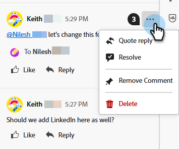

# Collaborazione e-mail {#email-collaboration}

La collaborazione e il commento tramite e-mail consentono ai team di marketing di rivedere, discutere e finalizzare in modo semplice le risorse e-mail all’interno di Adobe Marketo Engage E-mail Designer. Invece di condividere le bozze su strumenti esterni (come chat, thread e-mail, fogli di calcolo, ecc.), puoi commentare, suggerire modifiche e risolvere i feedback in tempo reale. Questo semplifica il flusso di lavoro, riduce gli errori e garantisce che le parti interessate siano allineate prima dell’invio di una campagna e-mail.

## Autorizzazioni {#permissions}

Gli utenti che dispongono delle autorizzazioni di modifica per una risorsa e-mail potranno aggiungere commenti, assegnare tag e visualizzare commenti. Gli utenti con autorizzazioni di sola lettura per le risorse e-mail **non** potranno aggiungere o visualizzare commenti.

## Aggiungi commenti {#add-comments}

1. Durante la creazione o la modifica di un’e-mail nel Designer e-mail, fai clic su una struttura, una colonna o un contenuto (testo, immagine, pulsante, ecc.) sopra una sezione modificabile.

   

1. Fai clic sull’icona del commento.

   

1. Inserisci feedback, domande o suggerimenti.

   

>[!NOTE]
>
>Assegna tag ai compagni di squadra utilizzando @mentions (ad esempio, &quot;@John, aggiorna la newsletter invernale&quot;).

## Visualizza tutti i commenti {#view-all-comments}

1. Fai clic sull&#39;icona _Collaboration_ a destra.

   

1. Rispondi rapidamente a un commento o aggiungi un Mi piace.

   

1. Fare clic sull&#39;icona **...** per ulteriori azioni.

   

## Risolvi commenti {#resolve-comments}

Ogni thread di commenti include:

* Risposta: continuare la discussione
* Risolvi: contrassegna il commento come risolto
* Non risolvere: se sono necessarie ulteriori modifiche
* Rimuovi: rimuove il commento dal relativo elemento di progettazione
* Elimina: elimina definitivamente il commento

>[!NOTE]
>
>I thread risolti sono nascosti per impostazione predefinita, ma possono essere modificati selezionando il thread desiderato nel filtro.

## Notifiche {#notifications}

I membri del team a cui vengono assegnati dei tag ricevono notifiche tramite e-mail e/o notifiche Pulse.

Le notifiche vengono attivate per:

* Nuovi commenti
* Menzioni (@username)
* Risoluzioni

## Best practice {#best-practices}

* Utilizza @mentions per garantire che il feedback arrivi rapidamente al membro giusto del team.

* Raggruppa i feedback correlati in un singolo thread di commenti invece di più note sparse.

* Risolvi sempre i commenti una volta indirizzati per mantenere un flusso di lavoro pulito.

* Salva una versione finale approvata a scopo di conformità/audit.
