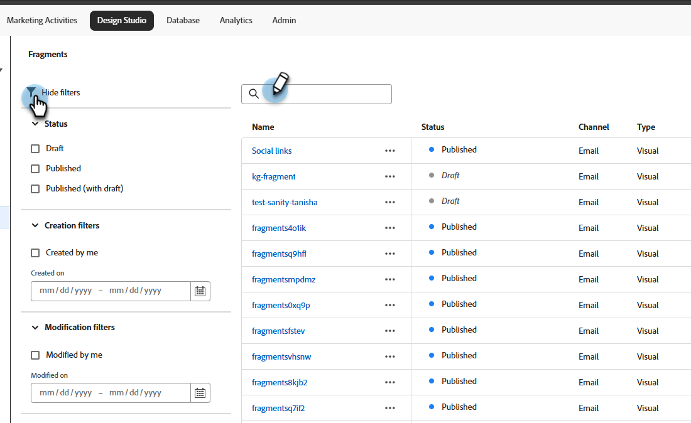
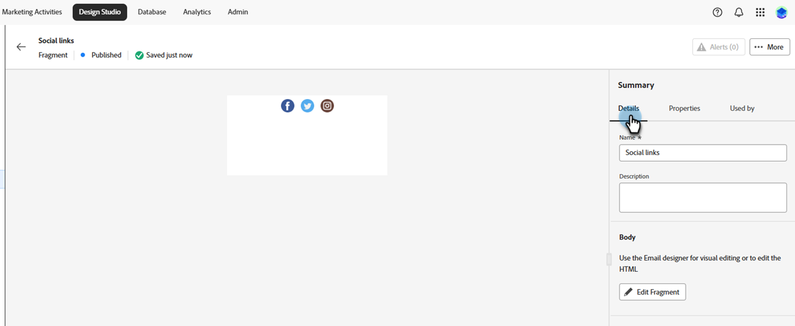
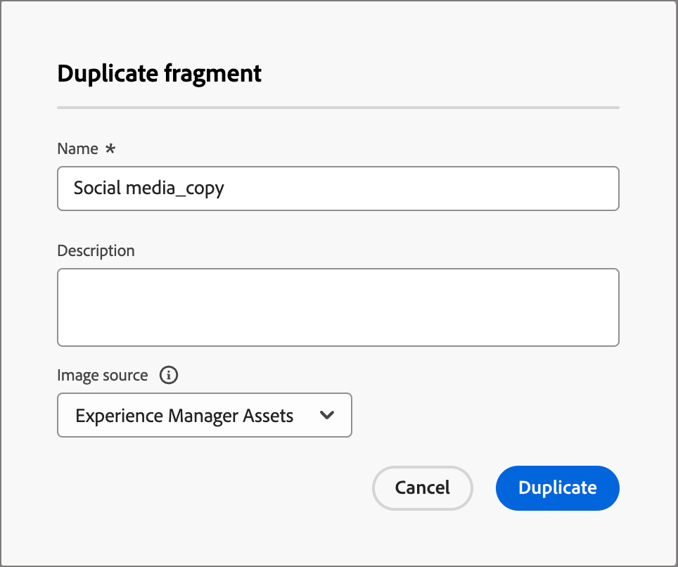

# Frammenti

Un frammento è un componente riutilizzabile a cui è possibile fare riferimento in uno o più modelli e-mail e e-mail. In genere si tratta di un blocco di contenuto (testo, immagine o entrambi) che può essere inserito rapidamente nel progetto. Con questa funzionalità, puoi precreare più blocchi di contenuto personalizzati per assemblare il contenuto delle e-mail e migliorare così il processo di progettazione. I casi d&#39;uso comuni includono blocchi di contenuto di intestazione/piè di pagina per e-mail, banner di invito a eventi, messaggi stagionali e altro ancora.

>[!NOTE]
>
>I frammenti sono l&#39;equivalente degli snippet[&#128279;](/help/marketo/product-docs/personalization/segmentation-and-snippets/snippets/create-a-snippet.md){target="_blank"} nel vecchio editor di posta elettronica.

Per utilizzare al meglio i frammenti nei flussi di lavoro:

* _Crea frammenti -_ Crea frammenti visivi, da zero o salvando contenuto come frammento dal contenuto visivo editor.
* _Riutilizzare i_ frammenti - Usarli tutte le volte che è necessario nel contenuto.

## Frammenti visivi {#visual-fragments}

I frammenti visivi sono blocchi visivi predefiniti creati (utilizzando il editor di contenuto visivo) che è possibile riutilizzare in più e-mail o modelli di e-mail.

## Accedere e gestire frammenti {#access-and-manage-fragments}

Per accesso frammenti visivi, passare a Design **Studio** in Marketo Engage. Nella struttura ad albero a sinistra, fai clic su **[!UICONTROL Fragments (New)]**.

{width="600" zoomable="yes"}

Per impostazione predefinita, la tabella è ordinata per colonna _[!UICONTROL Modified]_. Fare clic sui titoli di altre colonne per modificare l&#39;ordinamento della tabella. Fai di nuovo clic sullo stesso titolo per passare da crescente a decrescente.

### Trova e filtra

Utilizzare la barra ricerca per individuare un frammento in base al nome. Fai clic sull&#39;icona _Filtra_ (  ) per visualizzare le opzioni di filtro disponibili e scegliere le impostazioni desiderate.

{width="700" zoomable="yes"}

### Personalizzare le colonne {#customize-the-column-display}

Personalizza le colonne da visualizzare nella tabella facendo clic sull&#39;icona _Personalizza tabella_ (  ) in alto a destra.

Selezionare le colonne desiderate e fare clic su **[!UICONTROL Apply]**.

{width="400" zoomable="yes"}

### Stato del frammento {#fragment-status}

Lo stato del frammento ne determina la disponibilità per l&#39;utilizzo in un messaggio e-mail o in un modello e-mail e le modifiche che è possibile apportarvi.

<table>
<tbody>
  <tr>
    <td width="25%"><b>Bozza</b></td>
    <td width="75%">Quando crei un frammento, questo si trova nello stato Bozza. La bozza rimane tale fino a quando non la pubblichi per l’utilizzo in un messaggio e-mail o in un modello e-mail.
    
Azioni disponibili:
    <li>Modifica tutti i dettagli</li>
    <li>Modifica in designer visivo</li>
    <li>Pubblicazione</li>
    <li>Duplica</li>
    <li>Elimina</li>
  </td>
  <tr>
    <td><b>Pubblicato</b></td>
    <td>Quando si pubblicare un frammento, diventa disponibile per l'utilizzo in un messaggio e-mail o in un modello di e-mail. I contenuto di frammento pubblicati non possono essere modificati nella finestra di progettazione visiva.
    
Azioni disponibili:
    <li>Modifica descrizione</li>
    <li>Aggiungi a un messaggio e-mail o a un modello</li>
    <li>Crea versione bozza</li>
    <li>Duplica</li>
    <li>Elimina (se non in uso)</li>
    </td>
  </tr>
  <tr>
    <td style="width:25%"><b>Pubblicato con bozza</b></td>
    <td style="width:75%">Quando crei una bozza da un frammento pubblicato, la versione pubblicata rimane disponibile per l’utilizzo in un modello e-mail o e-mail e il contenuto della bozza può essere modificato nella finestra di progettazione visiva. Se si pubblica la bozza della versione, questa sostituirà la versione pubblicata corrente e il contenuto verrà aggiornato in <i>tutti</i> i modelli e-mail e le e-mail in cui è in uso. 
    
Azioni disponibili:
    <li>Modifica descrizione</li>
    <li>Aggiungi a un messaggio e-mail o a un modello</li>
    <li>Modifica versione bozza in Progettazione visiva</li>
    <li>Pubblica versione bozza</li>
    <li>Duplica</li>
    <li>Elimina (se non in uso)</li>
    </td>
  </tr>
</tbody>
</table>

## Creare i frammenti {#create-fragments}

1. Per creare un nuovo frammento visivo, fare clic nella **[!UICONTROL Create fragment]** parte superiore destra della pagina dell&#39;elenco dei frammenti.

   {width="700" zoomable="yes"}

1. Assegna al frammento un **[!UICONTROL Name]** e un **[!UICONTROL Description]** facoltativo.

   _Requisiti del frammento_

   * Nome: massimo 100 caratteri, deve essere univoco, senza distinzione tra maiuscole e minuscole
   * Descrizione: massimo 300 caratteri
   * Caratteri: i caratteri alfa, numerici e speciali sono ammessi
   * I caratteri riservati sono **_non consentiti_**: `\ / : * ? " < > |`

   {width="400" zoomable="yes"}

1. Fai clic su **[!UICONTROL Create]**.

   {width="400" zoomable="yes"}

   >[!NOTE]
   >
   >Al momento il tipo **di un frammento non può essere modificato**.

   La finestra di progettazione visiva si apre con una tela vuota.

1. Utilizzare gli strumenti[&#128279;](/help/marketo/product-docs/email-marketing/email-designer/email-authoring.md#add-structure-and-content){target="_blank"} di progettazione contenuto per creare il frammento visivo contenuto.

1. Fate clic in **[!UICONTROL Save]** qualsiasi momento per salvare il frammento bozza.

1. Quando si è pronti per rendere il frammento disponibile per l&#39;utilizzo in un messaggio e-mail o in un modello di e-mail, fare clic su **[!UICONTROL Publish]**.

## Visualizza dettagli del frammento {#view-fragment-details}

Fare clic sul nome di qualsiasi frammento nella pagina dell&#39;elenco per aprire la pagina dei dettagli del frammento. È possibile scegliere di modificare il frammento, rinominarlo o aggiornarne la descrizione. Apportate gli aggiornamenti e fate clic al di fuori del campo del nome o della descrizione per salvare le modifiche.

>[!NOTE]
>
>Se un frammento pubblicato è utilizzato da un messaggio e-mail o da un modello e-mail, non è possibile modificarne il nome o modificare il contenuto. È possibile creare una versione bozza se si desidera apportare modifiche al frammento.

{width="600" zoomable="yes"}

Fare clic **[!UICONTROL Edit fragment]** per aprire il frammento nella editor visiva contenuto.

Uscire dalla visualizzazione in qualsiasi momento facendo clic sulla freccia _Indietro_ in alto a sinistra, per tornare alla pagina dell&#39;elenco _Frammenti_.

## Visualizza frammento utilizzato da riferimenti {#view-fragment-used-by-references}

Nella pagina dei dettagli del frammento fare clic sul **[!UICONTROL Used By]** scheda per visualizzare la posizione in cui il frammento viene utilizzato all&#39;interno del Marketo Engage.

>[!IMPORTANT]
>
>Un frammento attualmente in uso da un messaggio e-mail o da un modello e-mail non può essere eliminato.

{width="600" zoomable="yes"}

Fai clic sul collegamento per aprire l’e-mail o il modello e-mail corrispondente in cui viene utilizzato il frammento.

## Elimina frammenti {#delete-fragments}

Poiché un frammento attualmente utilizzato da un messaggio e-mail o da un modello di messaggio e-mail non può essere eliminato, assicurarsi di controllare i _riferimenti utilizzati prima di_ avviare la rimozione di un frammento. Inoltre, una rimozione non può essere annullata, quindi controlla prima di avviare un&#39;azione di eliminazione.

Per eliminare un frammento, è possibile utilizzare uno dei metodi seguenti:

* Dai dettagli del frammento a destra, fare clic su **[!UICONTROL Delete]**.
* Dalla pagina dell&#39;elenco _[!UICONTROL Fragments]_, fai clic sui puntini di sospensione accanto al frammento e scegli **[!UICONTROL Delete]**.

Questa azione apre una finestra di dialogo di conferma. È possibile interrompere il processo facendo clic su **[!UICONTROL Cancel]** oppure su **[!UICONTROL Delete]** per confermare l&#39;eliminazione.

{width="400"}

## Modificare i frammenti {#edit-fragments}

Le modifiche apportate a un frammento dipendono dal suo stato corrente:

* Quando un frammento è nello stato _Bozza_, puoi modificarne i dettagli e il contenuto visivo.
* Quando un frammento è nello stato _Pubblicato_, puoi modificare la descrizione del frammento, ma non il nome. Non è possibile modificare il contenuto visivo.
* Quando un frammento si trova in _Pubblicato con stato bozza_ , la modifica dei dettagli è limitata alla descrizione. Potete inoltre modificare i contenuto visivi per la versione bozza.

>[!BEGINTABS]

>[!TAB Bozza]

1. Nella pagina di _[!UICONTROL Fragments]_&#x200B;presentazione, fai clic sul nome del frammento per aprirlo.

   Viene visualizzata un&#39;anteprima del contenuto visivo, con i dettagli del frammento sulla destra.

1. Apportare le modifiche desiderate.

   {width="600" zoomable="yes"}

1. Per apportare modifiche ai contenuto nella finestra di progettazione visiva, fare clic su **[!UICONTROL Edit fragment]**. Al termine fai clic su **Salva** .

1. Fare clic su **[!UICONTROL Save]** o **[!UICONTROL Save & close]** per tornare ai dettagli del frammento.

1. Per rendere il frammento disponibile per l&#39;utilizzo in un messaggio di posta elettronica o in un modello di posta elettronica, fare clic su **[!UICONTROL Publish]**.

>[!TAB Pubblicato]

1. Dalla pagina dell&#39;elenco _[!UICONTROL Fragments]_, fare clic sul nome del frammento per aprirlo.

   Viene visualizzata un’anteprima del contenuto visivo, con i dettagli del frammento a destra.

1. Se necessario, modifica la descrizione.

   Per un frammento pubblicato, non è possibile modificare tutti gli altri dettagli.

1. Se desideri aggiornare il contenuto, fai clic su **[!UICONTROL Create draft version]** in alto a destra.

   Fare clic su **[!UICONTROL OK]** nella finestra di dialogo per aprire la versione bozza nella finestra di progettazione visiva. Se necessario, è possibile modificare `image source` KG - LINK HERE.

   {width="300"}

1. Fare clic su **[!UICONTROL Save]** o su **[!UICONTROL Save & close]** per tornare ai dettagli del frammento.

1. Per rendere il frammento disponibile per l&#39;utilizzo in un messaggio di posta elettronica o in un modello di posta elettronica, fare clic su **[!UICONTROL Publish]**.

>[!NOTE]
>
>Quando pubblichi la versione bozza, questa sostituisce la versione pubblicata corrente e il contenuto viene aggiornato nelle e-mail e nei modelli e-mail in cui è già in uso.

>[!TAB Pubblicato con bozza]

Esistono due modi per aprire la versione bozza per la modifica dalla pagina di elenco _[!UICONTROL Fragments]_:

* Fai clic sull&#39;icona _Altro_ (**...**) accanto al nome del frammento e scegli **[!UICONTROL Open draft version]**.

  {width="300"}

* Fai clic sul nome del frammento per aprirlo. Quindi, fai clic su **[!UICONTROL Open draft version]** in alto a destra.

Viene visualizzata un’anteprima del contenuto visivo per la versione bozza, con i dettagli del frammento a destra.

Per aggiornare il contenuto:

1. Fai clic su **[!UICONTROL Edit fragment]** in alto a destra. Al termine, fai clic su **Salva**.

1. Fare clic su **[!UICONTROL Save]** o **[!UICONTROL Save & close]** per tornare ai dettagli del frammento.

1. Per rendere il frammento disponibile per l&#39;utilizzo in un messaggio e-mail o in un modello di messaggio e-mail, fare clic su **[!UICONTROL Publish]**.

>[!NOTE]
>
>Quando si pubblicare la versione bozza, questa sostituisce la versione corrente pubblicata e il contenuto viene aggiornato nelle e-mail e nei modelli e-mail in cui è già in uso.

>[!ENDTABS]

## Frammenti duplicati {#duplicate-fragments}

È possibile duplicare un frammento utilizzando uno dei metodi seguenti:

* Nella pagina dell&#39;elenco _[!UICONTROL Fragments]_, fai clic sull&#39;icona_ Altro _(**...**) accanto al nome del frammento e scegli **[!UICONTROL Duplicate]**.
* Nella parte superiore destra della pagina dei dettagli del frammento fare clic e **[!UICONTROL ... More]** scegliere **[!UICONTROL Duplicate]**.

{width="600" zoomable="yes"}

Nella finestra di dialogo, immettere un nome univoco e una descrizione facoltativa. Fai clic su **[!UICONTROL Duplicate]**.

{width="400"}

Il frammento duplicato viene quindi visualizzato nell&#39;elenco _dei_ frammenti.

## Salvare un nuovo frammento da e-mail o contenuto del modello {#save-a-new-fragment-from-email-or-template-content}

Quando si crea/modifica un messaggio e-mail o un modello di messaggio e-mail nella editor visiva contenuto, è possibile salvare tutto o parte del contenuto come frammento per riutilizzarlo.

1. Per salvare contenuto come frammento, fate clic su **[!UICONTROL More]** e scegliete **[!UICONTROL Save as Fragment]**.

1. Selezionare i diversi elementi da includere nel frammento.

   Seleziona più strutture tenendo premuto il pulsante Maiusc o Control.

   È possibile selezionare solo strutture adiacenti.

1. Con il contenuto selezionato, fai clic in **[!UICONTROL Create]** alto a destra.

1. Nella finestra di dialogo, immettere un nome e una descrizione facoltativa per il frammento e fare clic su **[!UICONTROL Create]**.

Il frammento viene quindi visualizzato nella pagina di elenco Frammenti ed è disponibile per l&#39;uso _all&#39;interno di_ e-mail e modelli di e-mail.

## Aggiungere frammenti visivi all&#39;contenuto di e-mail o modello {#add-visual-fragments-to-your-email-or-template-content}

I frammenti sono progettati per essere riutilizzati. Puoi aggiungerne fino a 30 in un e-mail o modello e-mail e nidificarli fino a un solo livello.

* [Aggiungere un frammento a un messaggio e-mail](/help/marketo/product-docs/email-marketing/email-designer/email-authoring.md#add-fragments)

* [Aggiungere un frammento a un modello e-mail](/help/marketo/product-docs/email-marketing/email-designer/email-template-authoring.md#add-fragments)

Il contenuto del frammento viene aggiornato dinamicamente all&#39;interno della struttura per eseguire il rendering di un elemento visivo di come il contenuto appare nel messaggio e-mail.

>[!TIP]
>
>Se vuoi che il frammento occupi l&#39;intero layout orizzontale all&#39;interno del messaggio e-mail, aggiungi una [!UICONTROL 1:1 column] struttura e quindi trascina e rilascia il frammento al suo interno.

Una volta salvato, il modello e-mail/e-mail viene visualizzato nella pagina dei dettagli del frammento quando viene selezionata la _[!UICONTROL Used By]_&#x200B;scheda. I frammenti aggiunti non sono modificabili all&#39;interno dell&#39;e-mail o del modello: il frammento di origine pubblicato definisce il contenuto.

## Azioni frammento durante la creazione di e-mail e modelli {#fragment-actions-during-email-and-template-authoring}

Quando un frammento viene aggiunto a un&#39;e-mail o a un modello e-mail, il relativo contenuto non può essere modificato all&#39;interno dell&#39;e-mail o del modello. Tuttavia, è possibile applicare le azioni seguenti:

* **[!UICONTROL Delete]** - Questo rimuove il frammento dall&#39;e-mail corrente o dal modello di e-mail contenuto (l&#39;origine del frammento non è interessata).
* **[!UICONTROL Refresh]** - Questo aggiorna la contenuto del frammento nell&#39;e-mail o nel modello e-mail corrente. L&#39;aggiornamento è utile quando si desidera riflettere eventuali modifiche recenti apportate al frammento dopo l&#39;aggiunta al messaggio e-mail o al modello e-mail.
* **[!UICONTROL Duplicate]** - Duplica il frammento nello stesso modello e-mail o e-mail all&#39;interno dell&#39;editor. Il frammento duplicato viene aggiunto appena sotto l&#39;originale.
* **[!UICONTROL Open Fragment]** - Questo apre una nuova scheda browser con il frammento editor pagina e dettagli.
* **[!UICONTROL Break inheritance]** - Questo interrompe l&#39;ereditarietà del frammento (e delle sue modifiche) dalla sorgente. Utilizzare questa azione per rendere il frammento disponibile contenuto come contenuto indipendente e modificabile all&#39;interno del messaggio e-mail o del modello di messaggio e-mail. Questa azione rimuove anche il messaggio e-mail o il modello e-mail dal _riferimento Usato da_ per il frammento originale.

Quando selezionate il frammento nella pagina editor, queste azioni sono disponibili nella barra degli strumenti contestuale e nel pannello delle proprietà a destra.

{width="600" zoomable="yes"}

>[!MORELIKETHIS]
>
>[Frammenti personalizzabili](/help/marketo/product-docs/email-marketing/email-designer/customizable-fragments.md)
