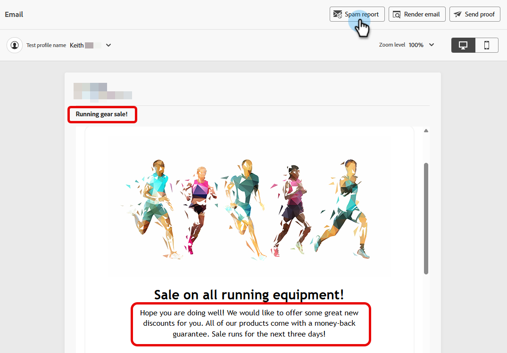

# Rapporto e-mail di spam {#email-spam-report}

Utilizzando SpamAssassin in Marketo Engage, puoi testare il contenuto delle e-mail e vedere la probabilità che gli ISP o i provider di cassette postali le contrassegnino come spam.

SpamAssassin analizza il contenuto e assegna un punteggio in base a vari criteri. Minore è il punteggio, meglio è. È importante mantenere un punteggio basso, in quanto l’invio di e-mail con un punteggio elevato può influire negativamente sul recapito messaggi complessivo.

## Accedere al rapporto di posta indesiderata {#access-the-spam-report}

1. Nell&#39;e-mail, fai clic su **Simula contenuto**.

   {width="600" zoomable="yes"}

   >[!NOTE]
   >
   >Se non hai già aggiunto un profilo di test, devi farlo subito dopo il passaggio 1.

1. Fai clic sul pulsante **Rapporto spam**.

   

1. Viene generato un rapporto di posta indesiderata.

   {width="600" zoomable="yes"}

1. Controlla i punteggi e le descrizioni di ogni elemento.

   >[!IMPORTANT]
   >
   >Se il punteggio complessivo è superiore a 5, l’e-mail potrebbe essere bloccata dal destinatario o contrassegnata come spam al momento della consegna.

1. Se il punteggio è troppo alto, modifica il contenuto nel Designer e-mail in base ai risultati del rapporto, quindi esegui nuovamente il **rapporto spam**.

   {width="800" zoomable="yes"}

Quando il punteggio è di tuo gradimento, è pronto per essere inviato.

{width="800" zoomable="yes"}

>[!NOTE]
>
>Il punteggio spam è derivato tramite SpamAssassin e **le regole non sono di proprietà di Adobe**. Ulteriori dettagli su queste regole sono disponibili nella [documentazione di SpamAssassin](https://spamassassin.apache.org/#_blank){target="_blank"}. Un elenco completo degli errori [è disponibile qui](https://spamassassin.apache.org/old/tests_3_0_x.html){target="_blank"}.
