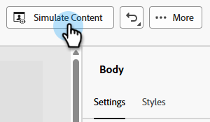

# Test del rendering di e-mail con Litmus {#test-email-rendering-with-litmus}

Sfrutta il tuo account [Litmus](https://www.litmus.com/email-testing) in Marketo Engage per visualizzare immediatamente il rendering delle e-mail nei client e-mail più diffusi.

>[!AVAILABILITY]
>
>Questa funzione è disponibile per tutti gli utenti di Marketo Engage che dispongono di un account Litmus attivo.

## Utenti Litmus Enterprise {#litmus-enterprise}

I seguenti passaggi sono per gli utenti del [Piano aziendale Litmus](https://www.litmus.com/pricing/enterprise){target="_blank"}.

1. Nella schermata _Modifica contenuto e-mail_, fare clic sul pulsante **Simula contenuto**.

   

1. Seleziona il destinatario del test e fai clic sul pulsante **Rendering e-mail**.

   {width="800" zoomable="yes"}

1. Se non lo hai già fatto, **connetti il tuo account Litmus**. Se lo hai già fatto, passa al passaggio 6.

   {width="800" zoomable="yes"}

1. Immetti le tue credenziali Litmus e fai clic su **Accedi**.

   >[!IMPORTANT]
   >
   >Quando connetti il tuo account Litmus a Marketo Engage, accetti che le e-mail di prova vengano inviate a Litmus. Dopo l’invio, queste e-mail di test non vengono più gestite da Adobe. Di conseguenza, i criteri e-mail di conservazione dei dati Litmus si applicano a tali e-mail, inclusi i dati di personalizzazione che possono essere inclusi in esse.

1. Fai clic su **Connetti** per completare l&#39;integrazione.

   

1. Fare clic sul pulsante **Esegui test** per generare anteprime e-mail.

1. Scopri l’aspetto del contenuto nei client e-mail desktop, mobili e basati su Web più diffusi. Fai clic su tutte le miniature che desideri visualizzare in anteprima.

   {width="800" zoomable="yes"}

   >[!NOTE]
   >
   >Scopri come [personalizzare l&#39;elenco dei client di posta elettronica predefinito](https://help.litmus.com/article/227-change-your-default-email-clients-list).

1. Al termine del test, fare clic sulla freccia indietro in alto a sinistra per tornare alla schermata _Simula contenuto_.

   

**PASSAGGIO FACOLTATIVO**: se decidi di apportare modifiche all&#39;e-mail, dopo aver fatto clic su **Esegui rendering e-mail** per visualizzarle, assicurati di fare clic anche sul pulsante **Ripeti** in alto a destra della schermata _Anteprime e-mail_ di Litmus.

## Utenti principali di Litmus {#litmus-core}

I seguenti passaggi sono per gli utenti del [piano core Litmus](https://www.litmus.com/pricing/){target="_blank"}.

1. Nel tuo account Litmus, recupera l&#39;indirizzo e-mail del test facendo clic sul pulsante **Copia indirizzo del test** nella schermata _Test_.

   {width="800" zoomable="yes"}

1. In Marketo Engage passare alla schermata _Modifica contenuto e-mail_ dell&#39;e-mail desiderata e fare clic sul pulsante **Simula contenuto**.

   {width="600" zoomable="yes"}

1. Seleziona i destinatari del test e fai clic sul pulsante **Invia bozza**.

   {width="800" zoomable="yes"}

1. Immetti l&#39;indirizzo e-mail Litmus copiato nel passaggio 1 e fai clic di nuovo su **Invia bozza**.

   

1. Controlla l’e-mail all’interno dell’account Litmus (nella cartella corrispondente all’indirizzo e-mail copiato da Litmus).

   {width="800" zoomable="yes"}
