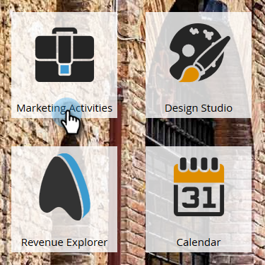
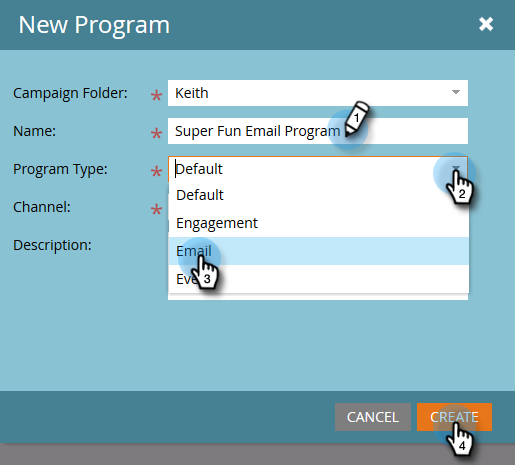

# Creare un programma e-mail {#create-an-email-program}

Utilizza i programmi e-mail per inviare un’e-mail in modo rapido e semplice a gruppi di persone.

1. Vai a **Attività di marketing**.

   

1. Seleziona la cartella in cui desideri creare il programma, fai clic sul pulsante **Nuovo** a discesa e seleziona **Nuovo programma**.

   

1. Immettere un nome, selezionare **E-mail** come Tipo di programma e fai clic su **Crea**.

   

   >[!NOTE]
   >
   >Quando si seleziona **E-mail** come Tipo di programma, il Canale viene automaticamente impostato su **Invia e-mail**. Può cambiarla se vuole.

   

Bello! Il programma è ora nell&#39;albero e pronto per essere utilizzato. Il passaggio successivo consiste nel definire il pubblico. Vedi gli articoli correlati a Marketo di seguito.

>[!MORELIKETHIS]
>
>* [Definire un pubblico con un elenco avanzato](/help/marketo/product-docs/email-marketing/email-programs/managing-people-in-email-programs/define-an-audience-with-a-smart-list.md)
>* [Definire un pubblico importando un elenco](/help/marketo/product-docs/email-marketing/email-programs/managing-people-in-email-programs/define-an-audience-by-importing-a-list.md)

